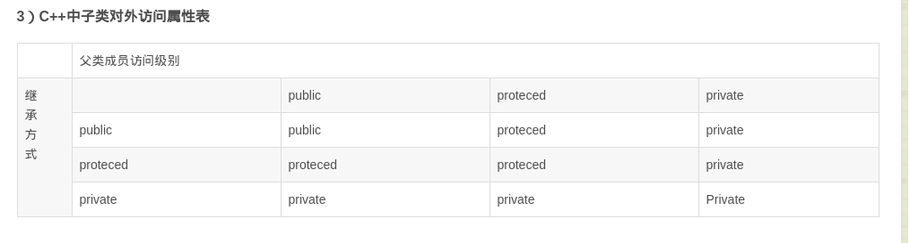
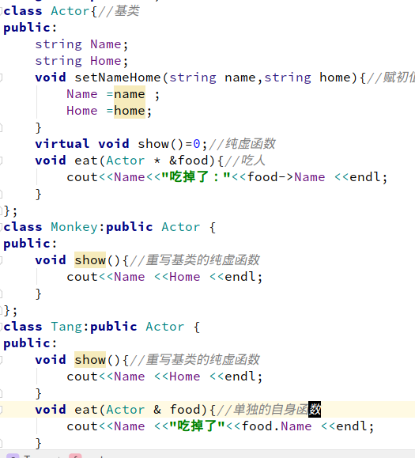
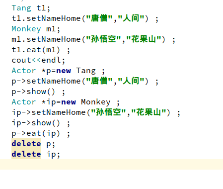
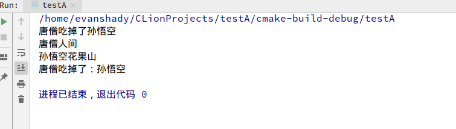

# C++Book
# 库
```
#include <iostream>
using namespace std;
int main(){
    cout<<hello would<<endl;
    return 0;
}
```
**在上面的代码我们应该都知道我什么都没有实现，这只是在简单的阐述一下c++库的重要性，也可以说是让我们更深刻的认识到有些代码的意思是什么。**

* #include,using (预编译指令) 
* iostream (是c++标准库，方便使用cout,cin,) 
* using namespace std (是命名空间,std,因为在库里大多数都有std命名空间的部分，所以规定这些名称为std)
# 结构函数
* 关键字struct+结构名
```
#include <iostream>
using namespace std;
struct point{
    int a=5;
    int b=10;
};
int main(){
    point *p=new point;    //在堆内存里new了内存
    p->a=10;
    p->b=5;
    cout<<p1->a<<"\t"<<p1-><<endl;
    point p1;              //在栈内存里实现
    cout<<p1.a<<"\t"<<p1.b<<endl;
}
```
运行结果：
```
5    10
5    10
```
**其实结构和类是相似的**

----
# 联合函数
* 关键字union+名字
```
#include <iostream>
using namespace std;
union test{
    int a;
    char b;
};
int main(){
    test *p=new test;         //在堆内存new了内存
    p->a=97;
    cout<<p->a<<"的字符表示是："<<p->b<<endl;
    test t1;                  //在栈内存里实现
    t1.a=65;
    cout<<t1.a<<"的字符表示是："<<t.b<<endl;
}
```
**一样的和类相似，在栈和堆内存一样使用,不相同的是：联合函数你可以给变量的其中一个赋值，而另外一个变量会自己把已经赋值的那个变量的值赋给自己。**

----
# 枚举函数
* 关键字enum+名字
```
#include <iostream>
using namespace std;
enum Arrow{
    eroos,ok,warning,
}
int main(){
    Arrow a1=eroos;
    Arrow a2=ok;
    Arrow a3=warning;
    cout<<a1<<a2<<a3<<endl;
}
```
运行结果：
```
0
1
2
```
**枚举的特点：它是以字符的形式声明的，但输出的确实整数型的数字**

----
# 递归函数
* 通俗一点的意思就是在本函数里调用自身函数。
* 最让我们看不懂的就是函数在返回的时候它是一层一层往上返回的。
```
#include <iostream>
using namespace std;
int add(int i){
    cout<<"函数开始:i="<<i<<endl;
    if(i=5){
        return i;
    }else
    {
        add(++i);
    }
    cout<<"函数结束,返回值为："<<i<<endl;
    return i;
}
int main(){
    cout<<add(1)<<endl;
}
```
函数的结果：`
```
函数开始：i=1
函数开始：i=2
函数开始：i=3
函数开始：i=4
函数开始：i=5
函数结束，返回值为：5
函数结束，返回值为：4
函数结束，返回值为：3
函数结束，返回值为：2
函数结束，返回值为：1
```
* 这里的先是返回的自身函数调用的结果，这里编译器里是有五个变量来暂时存储自身函数的值，每当执行到函数返回的时候编译器都会从暂时存储那里把值返回给我们，还有一种理解，就是这个函数里的变量在每次自身函数调用的时候都被隐藏起来了，也就是说每次的自身函数的调用它都有不同的存储位置来让变量重新赋值。其实，递归函数是在返回的时候才是这种函数真真的意义，因为自身函数的最后一次刚好是函数返回值的第一次。
----
# 函数与指针
* 指向函数的指针
```
#include <iostream>
using namespace std;
int add(int a){
    return a;
}
int test(int a){
    return a;
}
int main(){
    int (*p)(int a)=&add;//指向函数的指针
    cout<<P(5)<<endl;
    int (*ip[])(int a)={&add,&test};//指向多个函数的指针数组
    cout<<ip[0](1)<<ip[1](2)<<endl;
}
```
函数的结果：
```
5
1
2
```
* 这里的指针都是储存在栈内存里的。
----
# 预处理
* 格式化代码，去除多余的空格和注释
* 进行一些宏替换
* 包含另外一段代码
* 通过一些条件的判断，动态决定是否编译某段代码
1. 宏定义

**在定义宏的时候记得不要在定义的后面加分号！！！**
----
```
#include <iostream>
using namespace std;
#define MAX 9               //宏定义
#define MAN2 MAX*MAX        //宏定义
int main(){
    cout<<MAX<<endl;
    cout<<MAX2<<endl;
}
```
运行结果为：
```
9
81
```
2. 带参数的宏定义
```
#include <iostream>
using namespace std;
#define MAX 3                        //无参宏定义
#define space(x) ((x)*(x))           //声明一个带参数的宏定义
int main(){
    for(int i=1;i<=MAX;i++){
        cout<<i<<"的平方是："<<space(i)<<endl;
    }
}
```
运行结果是：
```
1的平方是：1
2的平方是：4
3的平方是：9
```
```
#include <iostream>
using namespace std;
#define add(a,b)(a+b)           //带参的宏定义
int main(){
    string s1("hello,");        //字符串
    string s2("world!");
    cout<<add(100,100)<<endl;
    cout<<add(s1,s2)<<endl;     //使用宏来实现字符串的相加
}
```
运行结果是：
```
200
hello,world
```
**说明了宏的优点有:避免了强类型的检测**
----
3. 宏与常量，函数
宏与常量有点相似，但当他们遇上指针和引用之后又会变成什么呢？
```
#include <iostream>
using namespace std;
#define x 10
const int y=5;
int main(){
    const int &a=x;          //ok
    const int *p=&y;         //ok
    cout<<a<<"\t"<<*p<<endl;
}
```
运行结果：
```
10    5
```
**这里给宏使用了引用，给常量使用了指针。还在定义的前面都加了const类型。**
**但是在这里还是不希望使用引用和指针的方式来操作宏和常量,把宏看作是简单的文本替换，这也是宏的原本意义。**

**宏不允许重新定义，也就是说一个相同的宏只能被定义一次，要想修改宏的值，你只能先消除它，使用#undef关键来消除，然后你就可以重新定义了。**
4. 在c++中有还有内置的宏
```
#include <iostream>
using namespace std;
int main(){
    cout<<__TIME__<<endl; //输出当前代码运行的时间
    cout<<__DATE<<endl;   //输出当前代码运行的日期
    cout<<__LINE<<endl;   //输出当前代码的所在行号
    cout<<__FIME__<<endl; //输出当前代码的文件路径
}
```
5. #if #elif #else  #ifdef #ifndef
```
#include <iostream>
using namespace std;
#define a 10
int main(){
    #if a<20
    cout<<"欢迎使用测试版"<<endl;
    #else
    cout<<"欢迎使用正版"<<endl;
    #endif
    return 0;
}
```
运行的结果：
```
欢迎使用测试版
```
**#if类似与我们在以前代码里的if，#else类似与else,#elif类似elseif**
**#endif,很重要。如果没有它你的程序是跑不起来的。**
```
#include <iostream>
using namespace std;
#define a 10
int main(){
    #ifdef a
    cout<<"欢迎使用正版"<<endl;
    #endif
    return 0;
    #ifndef
    cout<<"欢迎使用测试版"<<endl;
    #endif
    return 0;
}
```
**值得注意的是，#ifdef和#ifndef都要有#endif使用，#endif的意思应该是结束if**

----
# 预定义字符函数
**预定义字符函数就是把字符转换成大，小写的字符，在计算机中，我们虽然是以字符的形式输入到计算机中，但计算机本身的运作却是以数字的形式来使用的。值得注意的是，书上写的需要头文件但我这里是不需要头文件的，可能是版本的问题吧，如果有报错的话就加个头文件(cctype)**
1. toupper()(把字符转换成大写的)
2. tolower()(同上) 
3. isupper()(如果字符是大写的就为true，否则false)
4. islower()(同上)
5. isspace()(如果字符是空白字符就为true,否则false)
```
#include <iostream>
using namespace std;
void test(){
    char a,b;
    cout<<"请输入字符"<<endl;
    cin>>b;
    a=toupper(b)
    cout<<c<<endl;
    if(isupper(b)){
        cout<<"转换成功\t"<<a<<endl;
    }else{
        cout<<"转换失败"<<endl;
    }
}
int main(){
    test();
    char c;
    cout<<"请输入字符"<<endl;
    do{
        cin.get(c);
        if(isspace(c)){
            cout<<'--';
        }else{
            cout<<c<<endl;
        }
    }while(c!='.');
}
```
运行结果
```
请输入字符
a
转换成功   A
请输入字符
add test
add--test--
```
----
# 类
* 以前的数据和操作的过程都不是独立的，而c++允许我们将一些数据和操作数据的过程放在同一个地方，并封装成一个独立的个体。
* 万物皆对象，这句话对c++程序员来说并不陌生。这并不代表我们缺少对象，对于我们这种高质男来说从来没担心过搞不到对象，因为我们随时随地都可以new一个对象出来，这不是一般人可以做到的，只有真的走进来了才可以的，虽然这个操作在c++中也不算是什么高难度的操作，但我们又不是学到这里就完事的。类和结构是完全可以交换的，唯一不一样的是结构的默认特性是public,而类的默认特性是private。
* 封装，是用简单明了的公有函数的方式为外部程序提供对象操作接口。
# 成员对象
* 分为三种：public,private，protected
1. 公有对象：不管是在类里还是在外部都能被访问到。
2. 私有对象：只能在本类中访问到。
3. 保护对象：只能在本类中访问到，在外部是访问不到的。
# 运算符重载
* 这里就不在乎那么多的细节了。
```
class Son;//先声明Son类
class Bos{
friend int operator+(Bos bos,Son son);//友元函数，用来访问类的私有成员
friend ostream &operator<<(ostream &os,Bos bos);//友元函数，用来访问类的私有成员
private:
    int a=10;
    int b=5;
}
class Son{
friend int operator+(Bos bos,Son son);//友元函数，用来访问类的私有成员
ofriend stream &operator<<(ostream &os,Bos bos);//友元函数，用来访问类的私有成员
private:
    int a=5;
    int b=10;
}
int operator+(Bos bos,Son son){//运算符重载加号
    int a=bos.a+bos.b;
    int b=son.a+son.b;
    return a,b;
}
ostream &operator<<(ostream &os,Bos bos){//运算符重载<<号
    os<<"a="<<bos.a<<"b="<<bos.b<<endl;
    return os;
}
int main(){
    Bos bos;
    Son son;
    cout<<bos+son<<endl;//这要是没有重载加号，是运行不过的
    cout<<bos<<endl;//没有重载<<也是运行不过来的
}
```
**谨慎参考，纯属本人理解。ostream,是因为要用到cout流，因为输出流是属于ostream里面的，&,是因为返回的是一个输出流，所以要加个引用来指引。**
# const mutable
* 众所周知，const是常量类型。而mutable是可变的，就像是普通变量。
# 继承
```
class Teacher{
    string _name;
    int _year;
    Teacher(string name,int year){
        this->_name=name;
        this->_year=year;
    }
    void show(){
        cout<<this->_name<<"老师的年龄是："<<this->_year<<endl;
    }
}
class Student::puble Teacher{
public:
       Student(string name,int year):Teacher(name,year){
       }
}
```
**上面的基类用的是构造函数来给自己赋初始化的，所以在派生类也要写上自己的构造函数才算继承基类。**

```
int main(){
    Student s1("小明",18);
    s1.show();
}
```
运行结果是：
```
小明的年龄是：18 
```
**这里比较特殊的就是成员对象一般是构造函数给的初始化值，但我们在继承的时候往往会遇到问题，就是在声明派生类的时候会报错，这就是我们在基类的时候给的构造函数来赋初始化，我们只能再重写派生类的构造函数，这样才能算是真正的继承下来。**
----
* 继承的方式有三种：public private protected
公有继承, 私有继承, 保护继承
1. 公有继承：是以公有的形式来继承的基类，这也就意味着在基类是什么类型的在派生类也是一样的关系。
2. 私有继承：是以私有的形式来继承的基类,就是说继承下来的基类都是以私有的形式来继承的
3. 保护继承：是以保护的形式来继承的基类，它是基于公有继承和私有继承的中间，如果你不想在外界被访问到，又想在派生类中被访问，这就可以用保护的形式来继承下来了，但基类的私有成员对象在保护的派生类中依然是私有成员对象。

**派生类不会自动的继承基类的构造函数**
# 隐藏
* 我们以后难免会在派生类里定义属于它自己的成员变量和成员函数，但当我们在声明和定义的时候有时也会不小心的把成员变量和成员函数与基类的成员变量和成员函数名字相同，这是我们的程序就会出现名字隐藏的现象，对于隐藏就是说当我们的派生类与基类中有名字相同的，就可能会出现隐藏。如果不知道什么时候被隐藏了什么，我们可以加上作用域去看看，在这里，我的建议是，尽量不要在继承类里面用同样的名字，不然你会很自闭的。
* 基类的析构函数最好加上关键字（virtual）写成虚函数，这样在派生类的时候的就能自动调用，而对于，纯虚函数，在派生类中是要重写的性质，因为在基类的纯虚函数是空函数一个，它的本质就是一定要在派生类里面实现它的意义。一个良好的习惯：最好把基类的析构函数写成虚的，这样在派生类中是会自动调用的。
# 抽象类
* 其实就是在类里面把函数写成是纯虚函数，这样在派生类里就剩下重写这些虚函数。一般把抽象类用来设计一套统一的接口。



**重新认识了类的继承，这里我没有用到构造函数来给成员变量赋值，因为用了构造函数会变的很自闭，发正我是完全不能理解的那种，所以我用来另外一种方法，虽然算不上什么，但我觉得自己理解写出来的东西是可以的。孙悟空吃唐僧，这是多么厉害的，我想这个结果连孙悟空自己也不敢想的，我帮他实现了，嘻嘻。**
* 这里的基类是不能被实例化的，因为基类里面的show方法，我用的是纯虚函数来写的，不能被实例化，但在派生类要实现，你不实现的话，你写这个虚函数就没意义了，基类的纯虚函数在派生类你一定要写进去，不要编译器会报错的，
# 模板
* 关键字 template 
```
#include <iostream>
using namespace std;
template <typename T>
T add (T a, T b){
    return a+b;
}
int main(){
    cout<<add(1,2)<<endl;;
    cout<<add(10.1,10.2)<<endl;;
}
```
运行结果:
```
3
20.3
```
```
#include <iostream>
using namespace std;
int main(){
    double numb(55.55);
    coutw<<numb<<endl;
    cout.setf(ios::fixed);
    cout.setf(ios::showpoint)
    cout.precision(1);
    cout<<numb<<endl;
}
```
运行结果：
```
55.55
55.5
```