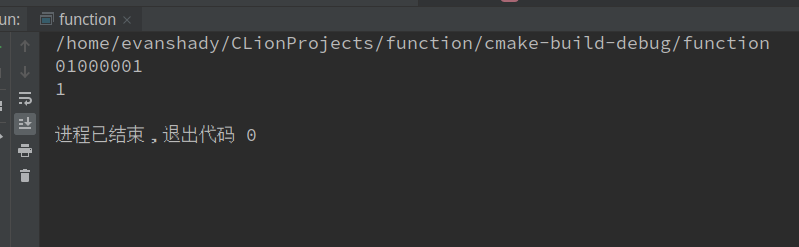

# Notes c++
1. 二进制
* 这里说的是调用一个c++函数来实现的。
```
#inciude <iostream>
using namespace std;
int main(){
     bitset<32>a(100)     //值得注意的是这里的32是数据类型转换bit来定义的。
     cout<<a<<endl;  //输出是以二进制的形式来输出的，也就是说，把数字转换成了二进制
     cout<<sizeof(int)<<endl;     //配上这个来使用比较明白
}
```

* 其实你也可以在上面的基础下把数据类型给换了，这样你也可以看你想要转换的二进制。
* IDE (集成开发坏境)
* 数据类型字节（本人电脑）
**int:4,float:4,long:4,double:8,char:1,bool:1,string:32,long double:16**
**wchar_c:4,**
----
2. 操作符:一元操作符，二元操作符，三元操作符。
* 一元操作符:操作在一个数的操作符。（++,--,&,*）
* 二元操作符:操作在两个数上的操作符。（+,-，*,/,%,）
* 三元操作符:操作在三个数上的操作符。(条件操作符，?:)等
---
3. 逻辑操作符(&&,||,!)
* &&(逻辑与):只要一个为0就为0，相反的两个为1才为1。
* ||(逻辑或):只要一个为1就为1，相反的两个为0才为0。
* !(逻辑非):自己脑补。
* **位操作符(&,|,^,~,<<,>>)**
* **&:位与。|:位或。 ^:异或。 ~:取补。 <<:左移。 >>:右移。**