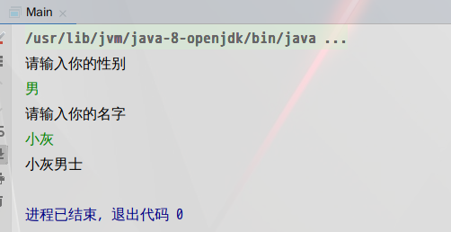
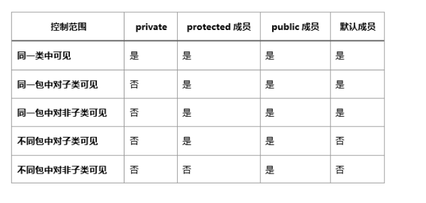

Write Once,Run Everywhere
 <!--more-->

 **达到对面向对象编程思想更加深入的理解，是对面向对象的各种特性及其实现细节更加熟练的掌握。** 

 ---

 *一步一个脚印的连好java的基本功。对于我来说是最好不过的，掌握java的基本语法。(类与对象，构造方法，引用传递，内部类，异常，包，java常用类库，javaIO，java类集)* 

1. 走技术之路(在学习java的同时，把基础的知识打好一定的基础)
2. 定位成为技术类管理成员(掌握基础的java知识，还要有几年的工作经验)
3. java软件开发发展前景好，移植性也很强。
- [ ] JDK(java开发工具包)

*是编程语言和javaAPI类库和java虚拟机(是完成移植性的重要机制)来组成的* 

- [ ] JRE(java运行时环境)
*是javaAPI子集和java虚拟机组成* 

**前面二者的区别是：JDK包含着JRE。如果仅仅是运行java程序的话就需要JRE。如果是要自己动手写java程序就要部署JDK环境。** 
---

**java系统可分为：javaEE(标准版)，javaSE(企业版)，javaME(微型版)，javaCARD(智能卡版)** 
---

```
//有必要说明一下，接下来的是在linux系统下使用终端来让我电脑上的文件进行运行

public class hello{//public(公有访问类型),class(类的标识),hello(类名)
    public static void main (String arg[]){//是main函数的基本格式,也表明main函数是静态方法
    System.out.println("hello,world!");//打印字符串"hello,world!"
    }
}
```

 

---

**这里要注意一下的就是文件的后缀是.java,其次是以javac 来作为第一次的关键字来操作文件，接着就会生成一个后缀为.class的文件，然后就是运行你写的文件，记住后面没有任何的后缀。** 

* **java是面向对象的过程，也就是说在java中只有方法而没有所谓的函数。** 

```
public class Test{
    public static void main(String args[]){
    scanner s=new scanner(System.in);//为了可以让用户输入，在这里使用了scanner类,因为它附属与System.in
    System.out.println("请输入你的性别");
    String set=s.nextLint();//以字符串的形式输入
    System.out.println("请输入你的姓名");
    String name =s.nextLint();
    switch(set){
    case "男":
    System.out.println(name+"男士");
    break;
    case "女":
    System.out.println(name+"女士");
    break;
    default :
    System.out.println("输入有误");
    break;
    }
    s.close();//关闭类
    InputStreamReader input=new InputStreamReader(System.in);//定义在键盘输入
    BufferedReader Buff=new BufferedReader(input);//以缓冲流的形式来接受input
    //用try和catch机制来处理异常
    try{
    System.out.println("请输入字符：");
    String s=Buff.readLine();
    System.out.println("字符："+s);
    }catch (Exception e){
    System.out.println("异常");
    }
}
```





*在这里只是简单的让用户输入了两次都是以字符串的方式来输入的，当然你也可以让用户输入你想让用户输入的数据类型(eg:int ,double)，上面也有参照的照片。* 

* **合法的标识符** 
- [ ] 不能存在关键字
- [ ] 首字母不能是数字
- [ ] 不能存在运算符
- [ ] 标识符是区别大小写的
- [ ] 标识符的命令规则是强制性的

`我们都知道数据的类型有int,short,float,double,byte(字节)。最常见的就是int(整形的数据类型)。在java中我们可以通过程序来输出各个数据类型的范围是多少，最大值和最小值，和数据类型
`

```
public class Test{
    public static void main (String args[]){
    int a=Integer.Size;
    System.out.println("int的范围:"+a);
    int b=Integer.MAX_VALUE;
    System.out.println("int的最大值:"+b);
    int c=Integer.MIN_VALUE
    System.out.println("int的最小值:"+c);
    Class <Integer> d=Integer.TYPE;
    System.out.println("数据类型:"+d);
    }
}
```

```
运行结果：
int的范围:32
int的最大值:2147483647
int的最小值:-2147483648
数据类型:int
```

---

```
public class Test{
            static int i=10;
    public static void main(String args[]){
            int a=1;
            int b=2;
            {
            int b=3;//main方法的变量名是不可以重复的，一个变量只能使用一个名，在这里就是重复使用了变量b，所以程序会报错。
            System.out.println("b="+b);
            System.out.println("a="+a);
            System.out.println("i="+i);
            }
            System.out.println("b="+b);
            System.out.println("a="+a);
            System.out.println("i="+i);

    }
}
```

```
上面的程序是运行不过的，这也是java的特别之处，在c++中，变量b是可以用的，但在java中是不可以的。
```

```
public class Test{
    public static void main (String args[]){
            char ch = '\"';//转义字符
            System.out.println(ch);
            System.out.println("\"hello,world!"\");
            System.out.println(ch+"hello,world!"+ch);
    }
}
```

```
运行结果
"
"hello,world!"
"hello,world!"
```
---

`总结可以得知，不管是用变量来存放转义字符，还是直接使用转义字符的方式来输出字符，程序都是可以顺利运行的，当然你也可以不使用变量来存放转义字符，但一个程序里面有太多的转义字符的存在你用变量来存放不是更好使用？这样你也不容易搞混已有的转义字符的使用。` 

```
public class Test{
    public static void main(String args[]){
        System.out.println(2+3+"k");
        System.out.println(6+6+"aa"+6+6);
    }
}
```

```
运行结果
5k
12aa66
```
---

`上面的2+3是一个表达式，所以这里是5,但后面跟的是字符和+(字符串相加)的符号，所以是5k,下面的也是一样的，唯一不一样的是在+(字符串相加)之后，计算机会自动认为后面的也是+(字符串相加)所以后面的就是12aa66。但如果把上面的双引号换成单引号就是以数字的形式先加后输出的。` 

# 数组

import java.util.Randow;//随机数字的包

```
public class Test{
    public static void main(String args[]){
                int i=3;//这是在堆内存的分配的内存(也可以说是在编译是分配的),读取速度快，但数据的活动范围小(缺少灵活性)
                int y=new Integer(1);//是在栈内存分配的内存(也可以说是运行时分配的内存),读取速度慢，但数据灵活性高。
                System.out.println((int)(Math.randow()*10));//生成随机数字，0～10
                Randow rand=new Randow();
                int i=rand.nextInt(10);//随机生成0～10的数字
                System.out.println(i);
    }
}
```

import java.util.Randow;//导入随机数字的包
```
public class test{
    public static void main(String args[]){
            Randow rand=new Randow();//声明随机数字的对象
            int []numb=new int [rand.nextInt(10)];//rand.nextInt(10)这句话的意思是随机生成一个0～10的数字作为数组的长度
            for(int i=0;i<numb.length;i++){//为数组赋值。从0～100来选择每次的赋值的数值
                numb[i]=rand.nextInt(100);
            }
            for(int a : numb){//打印数组里的元素
            System.out.println(a);
            }
    }
}
```

**在c++中的指针，在java是叫做引用数据类型，相当与c++中的地址指针** 
```
public class test{
    public static void main(String args[]){
    Randow rand=new Randow();//声明随机数字的对象
    int []a=new int[rand.nextInt(10)];//定义数组长度
    int []b=a;//把数组a赋值给数组b
    for(int i=0;i<a.length;i++){//为数组a赋值
            a[i]=rand.nextInt(100);
            System.out.println(a[i]);
            System.out.println(b[i]);
    }
    }
}
```

`上面程序的结果每次都是不要的，但值得注意的是输出的结果，肯定不会让你们失望的，因为数组b里面的元素是和数组a的元素是一样的。其实，上面最重要的一点就是数组b=数组a，它的等于是连着后面的a数组的赋值。` 

---

```
public class test{
    public static void main(String args[]){
            Randow rand=new Randow();
            int [][]numb=new int[3][1];//声明数组numb和给数组长度
            for(int i=0;i<numb.length;i++){//给数组赋值并输出数组里的元素
                for(int j=0;j<numb[i].length;j++){
                        numb[i][j]=rand.nextInt(10);
                        System.out.println(numb[i][j]);
                }
            }
    }
}
```

`一样的，上面的数组每运行一次程序的结果都是不一样的。` 

---
```
public class test{
    public static void main(String args){
            int []numb=new int[]{10,23,41,6,11};//声明一个数组，并赋初值
            Randow rand=new Randow();  
            int a=rand.nextInt(4);//生成随机数字，范围是1～4
            for(int i=0;i<a;i++){//把随机数字的大小作为条件,并从一开始交换位置
                int temp=numb[i];
                numb[i]=numb[i+1];
                numb[i+1]=temp;
            }
            for(int b:numb){//输出数组里的元素
            System.out.println(b);,你在这个时候使用基本数据类型是不能放进去的，因为容器里面都是放            }

    }
}
```

`上面程序实现的是乱序，就是每次输出的结果都是不一样的。` 

---

# 对象
**类描述了对象的属性和对象的方法，类是对象的模板，更可以说，对象是类的实例，是一个实实在在存在的个体。所以说，面向对象的程序重要的是类的设计而不是对象的设计。** 
`类的声明格式:` 
- [ ] [标识符] class 类的名称
{
        //类的属性
        //类的方法
}
`类的标识符:` 
- [ ] 默认的(default):这个类只能被这个类的对象和同一个包中的其它的类访问，即使是其它包里的这个类的子类都不能被访问，它只认同一包里的类。

- [ ] 私有(private):如果一个方法或者属性被定义为私有的，那么只能在本类里访问它。

- [ ] 公有(public):如果一个方法或属性被定义为公有的，那么它不仅能跨类的对象所调用，还能在其它包中被访问。

- [ ] 保护(protected):如果一个方法或属性被定义为保护的，那么它能被本类的方法所访问，也能被子类所访问，即使子类在其它包里。

 

```
public class Test{
    public static void main (String args[]){
            System.out.println("------"创建对象"-------");
            new Apple();//匿名对象
    }
}
class Apple{
        static String a="string-a";
        Static String b;
        String c="string-c";
        Strint d;
        Static{//static 属于静态代码块，最先运行的是这段代码块，而不是类的构造函数先
                printstatic("before static");
                b="string-b";
                printstatic("after static");
        }
        static void printstatic(String name){//这里要加静态的关键字，因为调用是静态来的所以这里也要有静态的关键字来表明这里是静态，不然是会报错的。
                System.out.println("------"+name+"-------");
                System.out.println("a="+a);
                System.out.println("b="+b);
        }
        Apple(){
            print("before class");
            d="string-d";
            print("after class");
        }
        void print(){
                System.out.println("------"+name+"-------");
                System.out.println("a="+a);
                System.out.println("b="+b);
                System.out.println("c="+c);
                System.out.println("d="+d);

        }
}
```
 

```
上面的对象是经过匿名对象来实例化的，也就是没有给new的对象一个堆内存，一旦这句语句实现完，计算机会自动回收这个内存，将不再存在程序里，这也是java的垃圾回收机制(BC)，这也是为我们考虑的，不知道你有没有发现，上面的几个程序我都是用new来给类分配的对象，但我不但没有在类中写析构函数，也没有在main函数里delete对象的实例化。因为这一切都是java的BC机制帮我们做了。

```
public class Test{

    public static void main(String args[]){
            String name=new String ("java");
            String _name=new String ("java");
            String hua=_name;
            if(name==_name){
            System.out.println("地址相同");
            }else{
            System.out.println("地址不同");
            }
            if(name.equals(_name)){
            System.out.println("内容相同");
            }else{
            System.out.println("内容不同");
            }
}
运行结果:
地址不同
内容相同
```

上面的程序分别实现了字符串地址(==)和字符串内容(equals方法)的比较，第一个变量和第二个变量的是经过new来分配的栈内存的地址，所以输出的是地址不相同,而最后一个的是进行的内容比较，因为初始化的原因，这里也是输出的内容相同。


构造方法的注意事项
- [ ] 构造方法的名称与类的名称是一样的
- [ ] 构造方法也是和普通方法一样的，可以被重载，但构造方法的调用是通过在创建类的对象的时候自动调用的，这是与普通方法的调用是不一样的
- [ ] 构造方法是没有返回值的
- [ ] 构造方法是不能被static和final修饰的
- [ ] 构造方法是不能被继承的，如果子类要使用父类的构造方法只能使用关键字(super)来进行调用

```
public Test{

    private String name;
    Test(){
    System.out.println("类的无参构造方法的调用");
    }
    Test(String _name){
        this->name=_name;
        System.out.println("类的有参构造方法的调用");
    }
    public static void main(String args[]){
            new Test();//这是匿名调用类的构造方法
            Test test=new Test();//这和上面是等价的
            Test t1=new Test("小明");
    }
}

上面的程序做的只是简单的演示类的构造方法的重载。

```
public Test{
    public static void main(String args[]){
    Apple apple;
    apple=Apple.V();
    System.out.println("姓名:"+apple.name);
    }
}
class Apple{
        String name;
        private Apple (){
        name="hello";
        }
        private static final Apple APPLE=new Apple();
        public static V(){
        return APPLE;
        }
}
```

上面的程序的重要性是:当你不想一个类被频繁调用的是时候，可以通过对类的构造方法的私有化来实现


# 代码块
- [ ] 普通代码块(就是普通的放在Main方法里面的代码块)
- [ ] 构造代码块(放在类里面，比构造方法更先一步执行的代码块)
- [ ] 静态代码块(比构造代码块更快一步，如果和Main方法是放在同一个类的话，那它比Main方法更快一步执行)
- [ ] 同步代码块

> 普通代码块

```
public class Test{
        public static void main(String args[]){
        {int x=10;//普通代码块
        System.out.println("x");
        }//如果不要这个代码块，程序将会报错，因为在一个方法里，不能有同名的变量名
        int x=100;
        System.out.println("x");
}
}
```

```
运行结果为:
10
100
```

>> 构造代码块

```
public class Test{
    public static void main(String args[]){
           Peron p=new peron(); 
           Peron p1=new Peron("笑话");
    }
}
class Peron{
    private int x;
    String name;
    {
    System.out.println("构造代码块的调用");//这是构造代码块
    x=10;
    }
    Peron(){
        System.out.println("类的无参构造方法的调用\t"+x);
    }
    Peron(String _name){
    this->name=_name;
    System.out.println("类的有参构造方法的调用\t"+x);
    }
}

```
```
程序的运行结果为:
    构造代码块的调用
    类的无参构造方法的调用  10
    构造代码块的调用
    类的有参构造方法的调用  10
```

上面类中是有一块属于构造代码块，而它的速度比构造方法的调用都还快，以前我们只知道对于类来说，构造方法是第一个调用的，因为在我们声明类的对象的时候就是通过类的构造方法来实现的，但现在不一样的是，你只要在类中加个中括号({}),里面的代码实现比类的构造方法都还要快被实现，这使得我们的代码更简化一步。比如，就像上面一样，给一个成员变量复制，而不是通过它的构造方法来实现，你只需要定义一个变量，然后再加个({}),就能实现对成员变量的复制，速度还比类的构造方法快一布。

**由此我们可以知道，类的代码块中的初始化是一个类的所有构造方法都共有的“交集”部分，具有个性化的初始化还是要放在各自的构造方法里** 


>>> 静态代码块

```
public class Test{
    static {
    System.out.println("静态方法的调用");
    }
    {
    System.out.println("构造代码块的调用");
    }
    Test(){
    System.out.println("构造方法的调用");
    }
    public static void main(String args[]){
            System.out.println("创建第1个对象");
            new Test();
            System.out.println("创建第1个对象");
            new Test();
            System.out.println("创建第1个对象");
            new Test();
    }
}

```
```
程序的运行结果为:
    静态代码块的调用
    创建第1个对象
    构造代码块的调用
    构造方法的调用
    创建第2个对象
    构造代码块的调用
    构造方法的调用
    创建第3个对象
    构造代码块的调用
    构造方法的调用

```


**从上面的案例可以看出来，在执行时机上，静态代码块是在类加载的时候就会执行的，因为早于类的构造代码块和类的构造方法。当一个静态代码块和Main方法在同一个类中，Main方法的调用也是在静态代码块的后面的。静态代码块的执行级别是最高的。**    


```
public class Test{
    public static int [] show(int []numb){
        numb[0]=10;
        numb[1]=12;
        numb[2]=13;
        return numb;
    }
    public static void show1(int []numb){
        for(int i:numb){
        System.out.print(i+"\t");
        }
    }
        public static void main(String args[]){
            int [] numb =new int{1,2,3,4,5};
            for(int i:numb){
            System.out.print(i+"\t");
            }
            System.out.println();
            System.out.println("--------------");
            show(numb);
            Show1(numb);

    }
}
```

```
    程序的运行结果为:
    1 2 3 4 5 
    10 11 12 4 5
```

`上面的程序只是简单的利用java的特性用新的方式来打印数组，只需要一个变量来操作数组对象就行了，比我们之前在c++中的方式简便多了，也是代码的量也减少了，这无疑是一件好事，还利用了引用数据类型来实现对数组的操作，更加利用了静态方法来进行对数组里的元素更改。` 


```
import java.util.*//导入sort包
public class Test{
    public static void main(String args[]){
    int []numb={10,2,46,33,5};
    Arrays.sort(numb);//进行数组的排序
    System.out.println("排序后:");
    for(int i:numb){
    System.out.print(i+"\t");
    }
        
    }
}

```  


```
程序的运行结果为:
排序后:
2 5 10 33 46
```

# 枚举(enum)
`enum A{红色，黄色，白色}枚举是作为类来被调用的，在定义的同时是连着对象的构造方法一起被调用的` 
```
enum Cloro{红色，黄色，白色}//是枚举的关键字,定义了一个枚举并初始化了
public class Test{
    public static void main(String args[]){
            //java中的枚举其实是一个类来的，在这个类里面还有很多不一样的方法，其作用都是不一样的。
            Cloro []cloro=Cloro.values();//Cloro.values()是类的静态方法来的，但是以字符串的形式来的，所以在前面要定义一个同类型的数组来接收,方法是自动生成的
            for(Cloro i:cloro){
            System.out.println(i);
            }
            Cloro c=Cloro.valueof(Cloro.class,"白色");//以指定的颜色来赋给对象,这里的参数有点不一样的就是，参数是类的类型,方法是自动生成的
            System.out.println(c);
            
    }
}
```

```
运行结果:
红色
黄色
白色
白色
```

枚举的注意事项
- [ ] 如果把枚举的标识符定义为public的话要放在独立的文件里面而不能和main方法放在同一个文件，如果标识符是默认的话就可以放在同一个文件里
- [ ] 使用enum来定义枚举的时候，默认会继承于java.lang.Enum类。默认会用final来修饰，因此无法派生子类。
- [ ] 使用enum来定义的时候，初始化也要和定义一起,如果没有把赋值放在同一行，而这个enum将无法被实例法。
- [ ] 所以使用enum来定义枚举的时候都会默认生成values方法，该方法可以方便遍历所有枚举值，而在枚举中还是有其它的自动生成的方法来给我们使用。

**enum(枚举)用关键字定义的时候相当于定义了一个类，而这个类继承于Enum类。而在Enum类中的所有方法都是保护类型的，因此这些方法都可以在声明了enum对象中被使用。** 

```
enum A{红色，紫色，白色}
public class Test{
    public static void main(String args[]){
            A []a=A.valuse();//把枚举中的元素都放在对应类型的数组中
            for(A i:a){
            System.out.println(i.name+i.ordinal());输出的是数组中的元素和数组的下标
            }
    }
}
```

```
运行结果:
红色0
紫色1
白色3
```

`在枚举中的下表要是没有给定提定的数值，计算机就会自动给它一个下标，而下标的值是以数组的形式来赋值的。` 


`EnumMap是Map接口的子类，也就是说Enummap是继承于类Map的` 

```
import java.util.Map;//导包
import java.util.EnumMap;//导包
enum Color{红色，黄色，绿色}
public class Test{
    public static void main(String args[]){
        EnumMap<Color,String>emap=new EnumMap<Color,String>(Color.class);//映射<><KeyType,nameType>,更重要的是EnumMap的构造方法的参数不能为空，需要指定一个枚举类
        emap.put(Color.红色,"RED");//把映射的对象和值都写进去
        emap.put(Color.黄色,"YELLOW");
        emap.put(Color.绿色,"BLUE");
        for(Map.Entry<Color,String>me:emap.entrySet()){//把映射的键和值都打印出来,其中的两个方法是Map中的静态方法，EnumMap作为Map的子类所以能调用其中的方法。
        System.out.println(me.getKey()+me.getValue());
        }
    }
}
```

```
运行结果:
红色RED
黄色YELLOW
绿色BLUE
```

上面的打印用的是新的打印方法，而EnumMap的类型是Map来的，所以它要Map.来点出它的方法来进行打印,Key是不允许重复的，而它的值却允许重复，EnumSet是一个集合来的

```
import java.util.EnumSet;//导包
import java.util.Iterator;//导包
enum Color{红色，绿色，紫色}
public class Test{
    public static void main(String args[]){
        EnumSet<Color> set=EnumSet.allof(Color.class);//声明集合<EnumTepy>并把对应类型的枚举类放在集合中,allof是集合EnumSet中的静态方法，用来把参数中的枚举类放在集合中作为集合的元素
        Iterator <Color>iter=set.iterator();//声明迭代器并把集合放在迭代器中
        while(iter.hasNext()){//参数是确认迭代器中的元素是否为空,为空的时候返回false
        System.out.println(iter.Next());//打印迭代器中的元素
        }
        EnumSet <Color>aset=EnumSet.noneof(Color.class);//表示作为空的集合
    }
    Iterator iterator=aset.iterator();
    while(iterator.hasNext()){
    System.out.println(iterator.Next());//这里是打印不出来的，所以下面的结果为空
    }
}
```


```
运行结果:
红色
绿色
紫色
```


```
enum Color{
    RED("红色",3),BLUE("蓝色",4),YELLOW("黄色",5);//定义枚举并指定颜色和下标，是以私有构造方法来显示调用枚举类的属性，(也就是说成员)
    private String Name;//元素的名字
    private int Indext;//元素的下标
    private Color(String name,int indexc){//枚举类的构造方法是私有化的,所有的枚举对象都必须显示调用此构造方法。
            this->Name=name;
            this->Indext=indexc;
    }
    public static void setname(int indexc,String name){
        for(Color c:Color.values()){
            if(c.Indexc==indexc){
            c.Name=name;
            }
        }
    }
    public static void setindexc(String name,int indexc){
        for(Color c:Color.values()){
            if(c.Name==name){
            c.Indexc=indexc;
            }
        }
    }
    public String getname(String name){
    return name;
    }
    public int getindexc(int intexc){
    return intexc;
    }


}
public class Test{
    public static void main(String args[]){
        System.out.println(Color.RED.getname());//RED是枚举类型的Color的枚举实例。这些枚举实例是公有的静态对象(进一步说，它们可以视为枚举类的属性成员)
        System.out.println(Color.RED.getindexc());
        System.out.println(Color.BLUE.getname());
        System.out.println(Color.BLUE.getindexc());
        System.out.println(Color.YELLOW.getname());
        System.out.println(Color.YELLOW.getindexc());
        System.out.println("自定义元素");
        Color.setname(3,"白色");//通过属性下标来改变属性的名字
        System.out.println(Color.RED.getname());
        System.out.println(Color.RED.getindexc());
        Color.setindexc("黄色",7);//通过属性的名字来改变属性的下标
        System.out.println(Color.YELLOW.getname());
        System.out.println(Color.YELLOW.getindexc());
    }
}
```

```
运行结果:
红色
3
蓝色
4
黄色
5
白色
3
黄色
7

```

在上面的程序中都是通过私有的构造方法来显示调用成员属性的，在上面属性其实是RED,BLUE,YELLOW,只不过我在这里都没对它操作，在这里比较容易混淆的是，根本不明白谁才是枚举的成员属性，你也可以通过上面的Values()(是枚举类自动生成的用来遍历枚举属性的方法),其实在上面我也用到了这个方法来对成员属性的名字和下标来进行改变它们对应的值。在最开始的时候定义的枚举的属性其实是在调用私有构造方法来实现实例化。只要把这个搞懂了，其实那些改变成员属性的方法都是很简单理解的。


```
enum Color{
    红色
    {
        public String show(){
            return "RED";
        }
    },
    蓝色
    {
        public String show(){
            return "BLUE";
        }
    },
    黄色
    {
        public String show(){
            return "YELLOW";
        }
    };
    public abstract String show();//把上面的show方法定义为抽象方法(abstract)抽象关键字

}
public class Test{
    public static void main(String args[]){
        
        for(Color c:Color.values){
        System.out.println(c.ordinal+"\t"+c.name()+"----"+c.show());
        }
    }
}
```

```
运行结果:
0  红色----RED
1  蓝色----BLUE
2  黄色----YELLOW
```

抽象方法关键字(abstract)，修饰没有主体的方法，在这里需要在枚举对象中一一单独实现，否则报


```
enum Weekday {Sun,Mon,Tue}
public class Test{
    public static void main(String args[]){
            Weekday w=Weekday.Sun;
            switch(w){
                case Mon:
                System.out.println(Do Monday work);
                case Sun:
                System.out.println(Do Sunday work);
            }
    }
}
```

```
运行结果:
Do Sunday work
```

这里是当你定义的是枚举类中的哪个元素的对象的时候，通过switch来进行选择，你输出的语句是你在switch写的语句。


# 类
|控制范围|private|default|protected|public|
|----|----|----|----|----|
|类|只能内部类允许私有，只能在当前类被访问|可以被当前包中的所有类访问|只有在内部类可以被设为保护权限,相同包中的类和其子类可以被访问|可以被所有类访问|
|属性|只能被当前类访问|可以被相同包中的类访问|可以被当前包中的所有类访问和当前类的子类访问|可以被所有类访问|
|方法|只能被当前类访问|可以被相同包中的类访问|可以被相同包中的类访问和当前类的子类访问|可以被所有类访问|


`java中对于类来说有封装，继承，多态。` 

`java中类的成员变量的权限有私有，公有，保护，默认，在上面的表格中都给出了对应的权限范围，java类只有允许单继承不允许多继承，但允许多重继承，` 

```
import java.util.ArrayList;
public class Test{
    public static void main(String args[]){
    System.out.println("集合大小");
    Apple a=new Apple();//调用类的构造方法来实现对集合的操作
    ArrayList <Interger>array=a.getarray();//声明一个集合来对类中的公有方法中的返回值进行赋值给这个集合,很重要的是，在这里传的是引用而不是数据的副本。
    System.out.println(array.size());//打印集合的大小
    array.add(8);//对集合的引用进行加值的操作
    Arrjy <Interger>a1=a.getarray();又重新定义一个集合来对调用的类的公有方法的返回值进行赋值
    System.out.println(a1.size());//打印集合的大小
    System.out.println("集合元素");
    for(Interger i:a1){
    System.out.println(i);
    }

    }
}
class Apple{
        private ArrayList<Interger>array=new ArrayList<Interger>();//声明一个私有集合作为类的成员变量
        Apple(){//构造方法,对集合进行初始化
        array.add(1);
        array.add(1);
        array.add(1);
        }
        ArrayList<Interger>getarray(){//返回集合
        return array;
        }

}
```

```
运行结果:
集合大小
3
4
集合元素
1
1
1
8
```

**其实在上面的程序中最难懂的是，在main方法里的集合的操作是引用的操作而不是简单的副本操作，在java中，除了基本的数据类型，其它都是引用类型,其中类也是引用类型** 


关于继承的限制
- [ ] java中继承允许多继承，但也许多重继承
- [ ] 从父类继承的私有成员不能被子类直接使用，要通过方法来间接调用
- [ ] 子类在进行对象实例化的时候，先调用父类的构造方法对父类的成员变量进行赋值，然后在调用子类的构造方法，其作用是一样的。

```
public class Test{
    public static void mai(String args[]){
        
    }
}
final class A{
    final void show(){
    System.out.println("如果这个方法在不想被子类覆写，可以在方法前面加上这个修饰符来确定不被子类覆写");
    }

}
//class B extends A{}//是错误的,所以注释掉
```

上面的程序是不行的，因为父类的修饰符是final，它是不能被继承的

```
public class Test{
    public static void main(String args[]){
        A a=new B();
        a.show();
    }
}
class A {
    A(){
    System.out.println("父类的构造方法")
    }
    void show(){
        System.out.println("走");
    }
}
class B extends A{
    B(){
    System.out.println("子类的构造方法
    }
    void show(){
        System.out.println("飞");
    }
}
class C extends A{
    C(){
        System.out.println("子类的构造方法
}
    void show(){
        System.out.println("跑");
    }
}
```

```
运行结果:
父类的构造方法
子类的构造方法
飞
```

上面的程序主要是实现多态的重要性，还有就是继承的小细节，继承是先调用父类的构造方法之后再调用子类的构造方法。在刚开始的时候就写过了在上面是先声明一个父类对象来进行对子类的实例化，然后在调用子类中覆写父类成员方法的方法，其实你也完全可以通过子类的对象来对子类进行实例化，在这里主要是实现类的多态。


方法重载与覆写的区别
- [ ] 重载是在本类中实现的，而覆写主要是在子类中重写父类的方法
- [ ] 重载要求方法的参数个数和参数类型的顺序和参数的类型和方法名字，其中的任意一个不同。而覆写是方法名称和参数个数和类型与父类是一致的就行了


`this&&super` 
----
```
public class Test{
    public static void main(String args[]){
            B b=new B();
            b.show();
    }
}
class A{
        String name;
        void show(){
        this->name="java";
        }
}
class B extends A{
    String name;
    void show(){
        this->name="shanghai";
        super.show();
        System.out.println(name+"\t"+super.name);
    }
}

```

```
运行结果:
shanghai  java

```

|区别|this|super|
|----|----|-----|
|查找范围|先从本类中找到属性或方法，本类找不到再去父类寻找|不查询父类的属性或方法，直接从子类调用父类的指定属性和方法|
|调用构造|this使用的是本类的构造|super先调用的是父类的构造方法，然后在调用子类的构造方法|
|特殊|表示当前的对象|可以看作是父类的引用对象|
|关系|两者的关系是属于二选一的关系，不能被同时调用|
---
抽象类
----

```
public class Test{
        public static void main(String args[]){
        A a=new B("小艾",11);
        a.show();
        A a1=new C("笑话",12);
        a1.show();
    }
}
abstract class A{
        public abstract void show();
}
class B extends A{
        String name;
        int age;
        B(String _name,int _age){
        }
        public void show(){
        System.out.println("学生\t"+name+"\t"+age);
        }
}
class C extends B{
    C(String _name,int _age){
            super(_name,_age);
    }
    public show(){
    System.out.println("工人\t"+name+"\t"+age);
    }
}
```

```
运行结果:
学生  小艾  11
工人  笑话  12
```

上面的类A是一个抽象类来的，抽象类是不能被实例化的，顾名思义，抽象类是没有实现的方法的，在上面的父类中只有定义成员方法为抽象方法的的一个定义，没有实现的行为，抽象类的实现一般是在子类中一一实现的，这也得于抽象类的特性，抽象类是不能被实例化的，这样做会报错的，一般的抽象类都是有子类的，子类的重要作用之一是实现父类中的抽象方法，这是很重要的，还有就是，定义在父类的全部抽象方法在子类中都要重写这些抽象方法，不然会报错，记住是全部都要重写。


# 接口(interface)
`接口是java所提供的另外一种重要的技术，是一种特殊的类，它的结构和抽象类很相似。接口里的数据成必须初始化，数据成员均为常量，常见的是全局变量。` 
`为了避免在接口中添加新的方法后要修改所有的实现类，允许定义默认方法` 

使用接口的原则
- [ ] 接口必须有子类，子类依靠(关键字)implements来实现多个接口
- [ ] 接口的子类必须重写接口中的所有抽象方法
- [ ] 接口可以利用对象的多态性，利用子类的对象进行实例化
- [ ] 接口和一般的类是一样的，具有成员变量和成员方法，但数据成员必须进行初始化，而初始化的值是不能被修改的，相当与是常量，方法也必须是抽象的或者是(default)，所以在接口中这两个特性是可以忽略的，因为在接口中不管是成员方法或者是成员变量都是特性都是肯定了的。


```
public class Test{
    public static void main(String args[]){
            
            B b=new B();
            b.show();
            b.print();
        System.out.println(A.name);
        //System.out.println(b.name);//不能通过类的实现来访问静态成员
    }
}
interface A{
        public static String name="hello";
        public void show();
        default void print(){
        System.out.println("你好");
        }
}
class B implements A{
    //name="HELLO";//这个是错误的
    public void show(){
        System.out.println(name);
    }
}

```

```
运行结果:
hello
你好
hello
```

上面的程序只是简单的介绍接口的基本定义的格式，其中有成员变量和成员方法，而其中的成员变量是全局类型的(还必须给初始化值)，成员方法分两种，一种是抽象方法(在子类是实现的方法，在接口只是声明而已)，另外是其它类型的成员方法


**在这里在强调一次，接口与抽象类唯一不同的就是子类，对于接口来说可以实现多个接口，但抽象类是不能多继承的** 

```
public class Test{
    public static void main(String args[]){
        C c=new C();
        c.show();
    }
}
interface A{
    default void show(){
    System.out.println("A接口的默认方法");
    }
}
interface B{
    default void show(){
    System.out.println("B接口的默认方法");
    }
}
class c implements A , B{}
```

上面的程序是错误的，因为在接口中的默认方法中如果有同名的方法，你在调用方法的同时，编译器会不知道你要调用的到底是哪一个方法，这就产生了所谓的二义性，一般来说在接口中一定不要有同名的变量,还有就是上面的接口是没有抽象类型的方法，所以在子类中是空的


`在前面说过，接口是允许多继承的，接口中对于抽象类和接口的继承是先继承后实现` 


```
public class Test{
    public static void main(String args[]){
        F f=new F();
        A a=f;//声明一个接口对象来指向子类，主要是在调用方法的时候让你清晰的知道在那个接口中调用的是那个方法。你也可以不写，直接用子类的实例化对象来调用
        B b=f;
        C c=f;
        D d=f;
        a.show();
        b.prin();
        c.print();
        c.xiao();
        d.printd();
        d.xi();
    }
}
interface A{
        public static String name="小新";
        public void show();
}
interface B{
    public void prin();
}
interface  C extends A , B{//接口继承多个接口
    public void print();
    default void xiao(){
    System.out.println(name+"\t多接口继承");
    }
}
abstract class D implements A,B{//抽象类继承多个接口
    abstract public void printd();
    void xi(){
    System.out.println(name+"\t抽象类继承");
    }
}
class F extends D implements C{
    public void show(){
    System.out.println("你好");
    }
    public void prin(){
    System.out.println("hello,world");
    }
    public void print(){
    System.out.println("一个接口继承多个接口"+name);
    }
    public void printd(){
    System.out.println("抽象类继承多个接口");
    }
}
```

```


运行结果:
你好
hello,world
一个接口继承多个接口
小新 多接口继承
抽象类继承多个接口
小新 抽象类继承
```

在上面的程序中我们可以知道，对于接口的继承，一个接口可以继承多个接口(extends)来继承，继承的同时不用进行对继承的接口进行实现。抽象类继承多个接口(implements),继承的同时一样不要进行对已继承的接口的方法实现，但子类一定要对继承的接口和抽象类中的方法进行实现,还有就是，不管是多接口继承还是抽象类继承，都是基于继承的特性来实现继承的，都会继承父接口的成员变量。对于接口的成员变量一定要在声明的同时就进行初始化。


接口的作用--制定标准
`接口是标准，所谓的标准，指的是各方共同遵守的一个原则。只有操作标准统一了，所有的参与者才可以按照统一的规则操作` 

```
public class Test{
    public static void main(String args[]){
        Computer c=new Computer();
        c.show(new B);//拿子类的引用来作为参数调用父接口中的方法
        c.show(new C);//拿子类的引用来作为参数调用父接口中的方法

    }
}
interface USB{
        public void work();//这是抽象方法
}
class B implements USB{
    public void work(){
        System.out.println("USB在工作");
    }
}
class C implements USB{
    public void work(){
        System.out.println("USB在打印机中工作");
    }
}
class Computer{
    public void show(USB usb){//父接口作为方法的参数
        usb.work();//调用类中的方法
    }
}
```

```
运行结果:
USB在工作
USB在打印机中工作
```

上面展现的是接口作用--制定标准，利用接口USB来制定工作的标准，通过继承来实现接口中的方法，最后通过电脑类中的方法来调用在子类的实现

接口--工厂的设计
```
public class Test{
    public static void main(String args[]){
    A a=F.getname("apple");
        
    }
}
interface A{
        public void eat();
}
class apple implements A{
    public void eat(){
        System.out.println("吃苹果");
    }
}
class oright implements A{
    public void eat(){
    System.out.println("吃橙子");
    }
}
class F{
    public static A getname(String name){
        if("apple".equals(name)){
        return new apple();
        }
        if("oright".equals(name)){
        return new oright();
        }
        return null;
    }
}
```

```
运行结果:
吃苹果
```

此时的程序，在客户端没有和具体的子类耦合在一起，这样一来，如果再有更多的A接口子类出现，只需要修改F类即可，即:所有的接口对象都通过F类取得，在程序员自己开发的代码中，只要是遇见要取得接口对象实例的操作，都应该使用工厂设计模式。


匿名类使用注意事项
- [ ] 使用匿名类的时候必须是继承一个类或者是实现一个接口，但是两者不可同时兼得，只能是继承一个类或者是实现一个接口
- [ ] 匿名内部类是不能定义构造方法的
- [ ] 匿名内部类不存在静态方法和静态变量
- [ ] 匿名内部类属于局部内部类，所以局部内部类的限制同样对局部内部类生效
- [ ] 匿名内部类不能是抽象的，它必须是一个实现的继承类或者是实现接口的所有抽象方法

static
- [ ] 由static定义的类方法，可以直接由类名直接调用，另外的就是static属性是一个共享的属性

# 包装类
`API(应用程序编程接口)`

基本类型的包装类
----
|基本数据类型|基本类型的包装类|
|------------|----------------|
|int|Integer|
|double|Double|
|byte|Byte|
|char|Char|
|float|Float|
|shart|Shart|
|long|Long|
|boolean|Boolean|

装箱与拆箱
-----
所谓的装箱就是把基本数据类型用它们相对应的引用数据类型包起来，使它们具有对象的特质，例如把int包装成Integer类的对象
所谓拆箱就是与装箱刚刚相反，将Integer类的对象重新简化成基本数据类型
```
public class Test{
    public static void main(String args[]){
            Integer i=new Integer(10);
            int x=i.intValue();
            System.out.println(x);
            Double b=new Double(100.00);
            double b1=b.doubleValue();
            System.out.println(b1);

    }
}
```

```
运行结果:
10
100.00
```

上面的程序是利用拆箱来把Integer类的包装类拆成基本数据类型Int，下面的double也是一样的
装箱的操作:就是将基本数据类型变为包装类，利用各个包装类的构造方法来完成
拆箱的操作:将包装类变为基本数据类型，利用各自的类的xxx.Value()方法来实现

基本数据类型与String类的转换
----
**但是以下的操作是不包括Char类的，因为String类有一个CharAt方法可以取得指定索引的字符** 

`将String类型转换成基本数据类型` 

```
public class Test{
    public static void main(String args[]){
            String s="123";
            int i=Int.parseInt(s);
            String s1="123.6";
            double b=Double.parseDouble(s1);
            System.out.println(i);
            System.out.println(b);
    }
}
```

```
运行结果:
123
123。6
```

在将字符串换成基本数据类型的时候要注意一定要符合对应的数据类型，不能把数据类型搞混。

`把基本数据类型变为String类型` 

```
public class Test{
    public static void main(String args[]){
            int i=100;
            String s=String.ValueOf(i);
            System.out.println(s);
            double b=123.6;
            String s1=String.ValueOf(b);
            System.out.println(s1);
    }
}

```

```
运行结果:
100
123.6
```

上面是利用String类里的机制方法来进行对不同基本数据类型转换成String类。

# 日期操作类
|类名|说明|
|----|----|
|LocalDateTime|存储了日期和时间|
|LocalDate|存储了日期|
|LocalTime|存储了时间|


```
import java.time.LocalDate;
import java.time.YearMonth;
import java.time.Year;
impore java.time.MonDay;
public class Test{
    public static void main(String args[]){
            LocalDateTime l1=LocalDateTime.now();
            System.out.println(l1);//根据日期类来调用方法来打印现在的年月日,在这里就不打印了,自己尝试
            Year year=Year.of(2010);
            YearMonth yearmonth=year.at(2);
            LocalDate localdate=yearmonth.at(28);
            System.out.println(localdate);
            System.out.println(localdate.isEqual(localdate));
            MonthDay m=Monday.of(4,15);
            localdate l=m.atyear(2015);
            System.out.println(l);
    }
}
```

```
运行结果:
2010-2-18
true
2015-4-15
```
从上面的程序可以看出，在java中对日期的操作是非常强大的，可以根据自己的需求来慢慢进行设置，在上面我也给出了对于日期类的归属。


```
import java.time.*;
import java.time.format.*;
public class Test{
    public static void main(String aegs[]){
            LocalDate localdate=LocalDate.now();//获取当前日期
            DateTimeForMatter datetime=DateTimeForMatter.ofPattern("dd/mm/uuuu");//设置日期打印的格式
            String str=localdate.ofmat(datetime);//把当期日期放在设置好的日期格式
            System.out.println(str);//打印出来
    }
}
```

```
运行结果:
自己尝试了，仆街。
```

在java中，设置日期的格式是用过DateTimeForMatter类来设置格式的，然后把时间放在设置好的格式里，最后通过String类来进行打印出来。

# 正则

|正则标识符|意义|
|----------|----|
|\ |表示一位字符|
|\\|表示多位字符|
|\n|匹配换行|
|[abc]|a,b,c中的任意一位|
|[^abc]|表示不是abc中的任意一位|
|[a-zA-Z]|表示任意一位字母(不管大小写)|
|[0-9]|表示0-9任意一位|
|.|表示任意一位字符|
|\d|等价与0-9|
|\D|等价与[^0-9]|
|\s|表示一位空格|
|\S|表示非空格|
|\w|等价与[a-zA-Z0-9]|
|\W|等价与[^a-zA-Z0-9]|
|^|表示正则的开头|
|$|表示正则的结尾|

```
public class Test{
    public static void main(Strng args[]){
        if("123".matches"\\d+"){
            System.out.println("true");
        }else{
        System.out.println("false");
        }
        String s="1234@163.com";//给出字符串
        String s1="\\w+@\\w+.\\w+";//给出邮箱的格式(w:等价于[a-zA-Z0-9])
        System.out.println(s.matches(s1));//验证上面的邮箱格式
    }
}
```

```
运行结果:
true
true
```

上面的程序是通过正则来判断并输出结果的，上面的方法是正则类里的一个方法，意思是判断字符串是不是由数字组成的，是就输出true，不是就false，明显与结果是一样的。
|方法|意义|
|----|----|
|boolean matches(String test)|将字符与给出的正则表达式进行匹配验证|
|String replaceAll(String test,String replacement)|按照指定的正则进行替换|
|String replzceFirst(String test,String replacement)|按照指定的正则进行替换首个|

```
public class Test{
    public static void main(String args[]){
            String s="123abcd3546efg";
            String s1="\\d+";多个数字
            System.out.println(s.replaceAll(s1,""));//在字符串中替换数字
            System.out.println(s.replaceFirst(s1,""));//在字符串中替换首个字符前数字

    }
}
```

```
运行结果:
abcdefg
abcd3546efg
```

在上面我给出的正则表达式的表示符可以在这个程序里尽情的尝试，你也会有发现的，但重要的是对你的理解有帮助,这样学起来是理解性的学习而不是一味的烦躁。

BigDecimal(大数值)
----

```
import java.math.BigDecimal;
public class Test{
    public static void main(String args[]){
            BigDecimal b=new BigDecimal("3456789101112")
            BigDecimal b1=new BigDecimal("123456789");
            System.out.println(b.add(b1));//加法
            System.out.println(b.subtract(b1));//减法
            System.out.println(b.multipy(b1));//乘法
            System.out.println(b.multipy(b1).setScale(1,BigDecimal.ROUND_up));//乘法,但是以进一的形式来输出值
            System.out.println(b.divide(b1,BigDecimal.ROUND_DOWN));//除法
            BigDecimal b2[]=b.divideAndRemainder(b1);//除法，并把值放在数组里面
            System.out.println("商"+b2[0]+"余"+b2[1]);
    }
}

```

上面的程序主要是应对于大的数字，在int和long都无法容纳的时候就使用BigDecimal类型来进行操作，(结果自己动手)

**当需要在ArrayList和HashMap中放东西的时候,你在这个时候使用基本数据类型是不能放进去的，因为容器里面都是放object的。** 

```
public class Test{
    public static void main(String args[]){
            Integer i=100;
            Integer i1=new Integer(100);
            Integer i2=Integer.valueof(1000);
            System.out.println(i+","+i1+","+i2);
    }
}
```


```
运行结果:
100,100,1000
```

上面只是简单的用Integer类型来定义了三个不同方式Interger类型

|方法名称|返回类型|功能说明|
|--------|--------|--------|
|byteValue|byte|返回Byte类的一个byte类型值|
|compareTo(Byte test)|int|在数值上比较两个对象，如果相等返回0,如果调用的对象小于test,则返回一个小于零的值，否则大于零|
|doubleValue|double|返回一个Byte类double值|
|intValue|int|返回Byte类的一个int值|
|parseByte(String str)|byte|将string类型转换成一个byte类型|
|toString()|String|返回Byte类型的String值|
|equalse(Byte test)||调用的对象值等于test对象返回true，否则返回false|
|valueof(String str|byte x)|Byte对象|返回值为str或者x的Byte对象|

```
pubic class Test{
    public static void main(String args[]){
            Byte b=10;
            Byte b1=100;
            Byte b2=new Byte(b);
            System.out.println(b.compareTo(b1));//两个对象比较,当参数对象小于当前对象时，返回的是大于0的数值，相反则小于0,相等则是返回0
            System.out.println(b.compareTo(b2));//同上
            String s="19";//将String转换成Byte类型
            Byte byte=Byte.parseByte(s);
            System.out.println(byte);
            byte a=b.byteValue();//转换成基本数据类型byte
            System.out.println(a);
            int i=b.intValue();//同上
            Double d=b.doubleValue();
            String str=b.toString();
            System.out.println(str);
            System.out.println(b.equalse(b1));//这里比较的是对象的数值，而不是所谓的引用地址
            Byte b3=Byte.valueof("127");
            System.out.println(b3);

    }
}
```

```
运行结果:
-90
0
19
10
10.0
10
false
127
```

在上面的程序中只是调用了一些java里面的方法来实现的，这些方法都是Byte类的基本使用方法，供我们在不同的需求下完成一些操作,对于equalse(两个对象值进行比较)


```
public class Test{
    public static void main(String args[]){
            String s="hello";//直接将字符串赋值
            String s1="hello";
            String s2=new String ("hello");//通过new关键来实例化对象,在堆内存中存放的内容
            System.out.println("字符串s和s2的比较");
            System.out.println("字符串的内容:"+s.equals(s2));
            System.out.println("字符串的地址:"+s==s2);
            System.out.println("s和s1的比较");
            System.out.println(s==s1);
    }
}
```

```
运行结果:
字符串s和s2的比较
字符串的内容:true
字符串的地址:false
s和s1的比较
true
```

**对于地址我们可以这样来理解，先把String当作是一个类来看待，类的对象是引用传递的,引用传递的最后结果是，不同的栈内存存放的是同一个堆内存的地址值** 

在java中，string是一个类来的，类的名称是在栈内存里面的，但字符串的内容是在堆内存里的。上面的程序是利用String类的方法来进行将字符串里的内容进行比较的，上面的==则是利用String类对象的引用传递来进行比较的,在java中，要是字符串是采取直接赋值的方式来完成的，如s,那么在首一次定义字符串的时候，会自动在堆内存之中定义一个新的字符串常量"hello",如果在后面还跟着其它字符串对象(s1)，采取的还是直接赋值的方式而且内容还是一样的话，那么就不会开辟新的字符串变量，而是指向已有的字符串内容(s),所以最后面输出的是true,这种设计被称为共享设计模式。

手工入池
```
public class Test{
    public static void main(String args[]){
            String s="hello";
            String s1=new String ("hello").intern();//添加了手动入池的方法
            System.out.println("添加了手动入池的方法:");
            System.out.println(s==s1);
            String s2=new String ("hello");
            System.out.println("没有添加手动入池的方法");
            System.out.println(s==s2);

    }
}
```

```
运行结果:
添加了手动入池的方法:
true
没有添加手动入池的方法
false

```
手工入池的作用是，供其他内容相同的字符串对象使用
---


> 字符串和字符数组的转换

```
public class Test{
    public static void main(String args[]){
        String s="hello";
        System.out.println("按照指定的下标输出字符串的内容:");
        System.out.println(s.charAt(0));String类里面的方法
        char []chars=s.toCharArray();//把字符串转换成char类型的数组
        for(int i=0;i<c.length;i++){
            System.out.print(c[i]);
            c[i]-=32;
        }
        System.out.println();
        for(char c:chars){
        System.out.print(c);
        }
        System.out.println();
        System.out.println("将部分数组的内容生成为字符串:"+new String(chars,2,3));//这个方法你也可以不给指定的位置，那样输出的就是整个字符串的内容

    }
}
```

```
运行结果:
按照指定的下标输出字符串的内容:
h
hello
HELLO
将部分数组的内容生成为字符串:LLO
```

上面的程序是先定义一个String类的并直接赋值，然后在声明一个char类型的数组，并把刚刚定义的字符串拆成char数组，然后进行打印和换成字符串内容都换成大写的，然后在把数组转换成字符串
|方法|类型|描述|
|----|----|----|
|public String(char [] value)|构造|将收到的字符数组变为字符串|
|pubilc String (char [] value,int a,int b)|构造|将部分字符数组变为字符串|
|public char charAt(int index)|普通|返回指定的索引位置上的字符内容|
|public char [] toCharArray|普通|将字符串变为字符数组|

> 字符串和字节的转换
```
public class Test{
    public static void main(String args[]){
            String s="hello";
            byte []bytes=s.getbytes();
            for(int i=o;i<bytes.length;i++){
            bytes[i]-=32;
            }
            System.out.println(new String (bytes));
            System.out.println(new String (bytes,2,3))
    }
}

```

```
运行结果:
HELLO
LLO
```


|方法|类型|描述|
|----|----|----|
|public String (byte [] bytes)|构造|将全部字节数组变为字符串|
|public String (byte [] bytes,int a,int b)|构造|将部分字节数组变为字符串|
|public byte [] getBytes()|普通|将字符串变为字节数组|
|public byte [] getBytes(String charseName)throws|普通|将字符串转码|

> 字符串查找

|方法|类型|描述|
|----|----|----|
|public boolean contains(String s)|普通|判断一个字符是不是在字符串里|
|public int indexof(String s)|普通|由前向后查找字符，找不到就返回-1|
|public int lastIndexof(String s)|普通|从最后面查找字符，找不到就返回-1|
|public boolean startswith(String s)|普通|判断是不是以指定的字符开头|
|public boolean endswith|普通|判断是不是以指定的字符结尾|
|public String replaceAll(String s,String a)|普通|把指定的字符全部换成指定的字符|
|public String replzceFirst(String s,String a)|普通|把指定的第一个字符换成指定的字符|

```
public class Test{
    public static void main(String [] args){
            String s="hello";
            if(s.contains("o")){
            System.out.println("查找成功");
            }
            if(s.indexof("l")!=-1){
            System.out.println("字符l的下标为:"+s.indexof("l"));
            }
            if(s.indexof("l",3)!=-1){
            System.out.println("字符l的下标为:"s.index("l"));
            }
            if(s.laseIndexof("o",4)!=-1){
            System.out.println("字符o的下标为:"s.laseIndexof("o"));
            }
            System.out.println(s.startswith("h"));
            System.out.println(s.endswith("o",4));
            System.out.println(s.repalceAll("l","-"));
            System.out.println(s.repalceFirst("o","!"));
    }
}
```

```
运行结果:
查找成功
字符l的下标为:2
字符l的下标为:3
字符o的下标为:4
true
true
he--o
hell!
```

> 截取字符串的内容

```
public class Test{
    public static void main(String args[]){
            String str="hello";
            System.out.println(str.substring(2));//从下标2的位置开始直到末尾打印
            System.out.println(str.sunstring(2,4));

    }
}
```

```
运行结果为:
llo
ll

```

上面的程序是，通过方法来获得字符串的部分内容，如果这个方法里只有一个参数的时候，下标的位置是你给的参数的位置，两个参数的时候，下标的位置会被默认为0,而不是你给出的那个参数作为下标

> 字符串拆分

|方法|类型|描述|
|----|----|----|
|public String [] spilt(String test)|普通|按照指定的字符来拆分|
|public String [] spilt(String test,int a)|普通|将字符串拆分为指定元素个数的字符数组|

```
public class Test{
    public static void main(String [] args){
            String str="hel lo, world!";
            String []str1=str.spilt(" ");
            for(String s1:str1){
            System.out.println(s1);
            }
            String [] str2=str.spilt(" ",3);
            for(String s2:str2){
            System.out.println(s2);
            }
    }
}
```

```
运行结果:
hel
lo, world!
hel
lo,
world!
```

> 其它方法

```
public class Test{
    public static void main(String [] args){
        String str="hello, world!";
        System.out.println(str.length());
        if(!str.isEmpty){
        System.out.println(str.toUpperCase());//把字符串的内容换成大写，相反的小写是toLowCase()
        }
    }
}
```

```
12
HELLO,WORLD

```


上面的程序是实现拆分字符串的,这个方法的返回值是一个String类的数组，你要先定义数组来接住这个方法的返回值，前一个方法是按照给的字符来直接拆分的，而第二个刚开始也是按照给的字符来拆分，但第二个参数的意义则是让拆分的字符串以n个字符串来输出

# 引用传递
- [ ] 堆内存是栈内存的一个子集
- [ ] 栈内存是仅次与寄存器，栈内存里面的数据是共享的，但是其中数据的大小和生存期必须在运行前确定
- [ ] 堆内存是运行时动态的分配的数据区，从速度看小于栈内存，堆内存里面的数据是不共享的，但数据的大小和数据里面的内容可以在运行时给予
- [ ] new关键字是在运行时在堆内存中创建一个对象，每new一次都一定会创建一个对象，因为堆数据是不共享的

**栈内存的数据共享,比如，int i=1;这时i和1都放在栈内存中，然后在int j=1;此时的j是在栈内存，然后计算机会在栈内存中查找有没有1这个数字，如果有就把j指向1，如果把j赋值为2,此时的j一样是在栈内存中，只不过是在栈内存中查找有没有2，如果没有则生成一个栈内存给2,然后再把j指向2。** 

```
public class Test{
    public static void main(String [] args){
        int i=1;
        int j=1;
        System.out.println(i==j);
    }
}
```

```
true
```

上面的程序都在栈内存中定义一个变量i和j，一样的都指向了1,此时用==来判断地址是不是一样的，给的是true，如果把j赋值为2，然后在==，此时的答案是false，因为此时的栈内存是没有2这个数字的，只能在栈内存中重新再分配一个2,然后再把j指向2。


```
public class Test{
        String name;
        int age;
        public void show(){
        System.out.println(this->name+","+this->age);
        }
    public static void main(String [] args){
        Test t1=new Test();
        t1.name="小艾";
        t1.age=10;
        t1.show();
    }
}
```

```
运行结果:
小艾
10
```

上面的类对象其实就是一个引用对象来的，new代表的是在堆内存中分配空间，在java中是没有指针的，但代替的就是引用数据类型，引用数据类型就类的引用，代表的是类的地址值，


```
public class Test{
    String name;
    int age;
    public static void main(String [] args){
    Test t1=new Test();
    t1.name="小艾";
    t1.age=18;
    Test t2=t1;//引用传递
    System.out.println("姓名:"+t2.name+",年龄:"+t2.age);
        
    }
}
```

```
运行结果:
姓名:小艾,年龄:18
```

上面的程序先声明一个Test类对象并指向了Test，给Test类中的属性赋值，然后再声明一个t2并指向了t1(引用传递),然后再打印t2中的属性值。

**所谓的引用传递说的是，一块堆内存空间，同时被多个栈内存所指向，引用传递的核心认识:不同的栈内存如果同时指向同一块堆内存之中，所做的修改将影响所有的栈内存。** 

```
public class Test{
    public static void main(String [] args){
    Apple a=new Apple("小艾",18);
    Apple a1=new Apple("小艾",18);
    if(a.equalse(a1)){
    System.out.println("true");
    }else{
    System.out.println("false");
    }
    if(a==a1){
    System.out.println("true");
    }else{
    System.out.println("false");
    }

    }
}
class Apple{
        String name;
        int age;
        Apple(String _name,int _age){
        name=_name;
        age=_age;
        }
        public Boolean equalse(Object o){
        Apple a=this;
        if(o instanceof){
        Apple a1=(Apple)o;
        if(a.name==a1.name&&a.age==a1.age){
        return true;
        }else{
        return false;
            }
        }
        return null;
    }
}
```

```
运行结果:
true
false
```
上面的程序是利用方法来比较类的地址和中的属性是不是相等，第一个比较的是类的属性值是否相等，在这里我重写了类中的equsle方法来比较类的属性值，接着用==来比较类的地址值，在这里我声明类的对象的时候用的是关键字(new)所以类对象的地址值在这里是不相等的


```
public class Test{
    public static void main(String [] args){
        System.out.println("A.getA(0)");//调用的是你在类中重写的toString方法，而不是简单的打印方法，
    }
}
class A{
        String name;
        private A(String _name){
        this->name=_name;
        }
        private final A MAX =new A("男");//定义的类的常量来决定类的实例化对象
        private final A MIN=new A("女")//同上
        public static A getA(int i){
                switch(i){
                case 0:
                return MAX;
                case 1:
                return MIN;
                default :
                return null;
                }
                public String tostring (){//在main方法中调用的是这个方法
                return this->name;
                }
            }
}
```

```
运行结果:
男
```

上面的程序是把类的构造方法的标识符设置为private，这就让我们没办法在类的外面进行实例化对象，只能在类的内部实现类的实例化，在这里只能通过静态来调用类的私有构造方法进行实例化，先在类里面定义两个不变的常量，然后再定义一个静态方法来确定调用的是常量是哪一个，然后再重写打印的方法来打印出类中的属性值,由于你在类中通过static和final定义了两个不同的类对象的实例化常量，也就是说static是全局的，不管你类外面定义了多少个类的对象，而你实例化的对象只有两个，这也是所谓的单设计模式

# 包(package)
```
package demo.a;//包名
class Apple{
    String name;
    Apple(String _name){
    this->name=_name;
    }
    public void show(){
    System.out.println("name");
    }
}
package demo.b;//包名
import demo.a.Apple;//导包
public class Test{
    public static void main(String [] args){
        Apple a=new Apple("xiaoai");
        a.show();
    }
}


```

```
运行结果:
xiaoai
```

上面程序只是简单的演示了怎样调用不同包中的类，在java，由于是面向对象的程序，特别是在后期维护的时候，我们都知道是很难的，我们不但可以通过调用不同的包来区分类名，更是可以为了让代码看起来美观一点，更重要的是它让你区分了

# 异常处理

```
public class Test{
    public static void main(String [] args){
        try{
        int []numb = new int[4];
        numb[0]=1;
        numb[1]=0;
        int a=numb[0]/numb[1];
        }catch(ArithmetiException e){
        System.out.println("算法错误");
        }finally{
        System.out.println("此处一定会实现的");
        }
    }
}
```

```
运行结果:
算法错误
此处一定会实现的
```


**异常处理机制，有一定的格式(try--catch--finally)，try是用来异常的抛出，catch是用来捕获发生异常的对象，finally在程序是否会发生异常都会执行的语句段** 

当异常发生时，通常可用两种方法来处理，一种是交给java默认的异常处理机制做处理，但这种处理方式，java通常只能输出异常信息，接着便是终止程序的运行(上面的就是java提供的异常处理机制)，另外一种是自行编写异常处理机制来处理异常的发生。

> throws && throw

```
public class Test{
    public static void main(String [] args){
        try{
        int [] numb =new int[3];
        }catch(ArrayIndexOutOfBoundsExcepion ex){
        System.out.println("下标错误");
        ex.printStackTrace;//只是打印错误的信息，这里我就不写出来了，计算机里都有的
        }
    }
    private static Add (int [] num,int b)throws ArrayIndexOutOfBoundsExcepion{//把抛出的对象返回给上一级
        System.out.println("方法开始");
        try{
            num[b]=0;
        }catch(ArrayIndexOutOfBoundsExcepion e){
        throw e;
        }finally{
        System.out.println("方法结束");
        }
    }
}
```

```
运行结果:
方法开始
方法结束
下标错误
这里才打印错误的信息
```

>> 自定义异常类

```
public class Test{
    public static void main(String [] args){
        try{
        throw new Add("自定义异常类");
        }catch(Add a){
        System.out.println(a);
        }
    }
}
class Add extends Exception(String name){
        super(name);//调用Exception类的构造方法，存入异常信息
}
```

```
运行结果:
自定义异常类
```

# java类集框架

**java类集框架就是java对数据结构的一个大体上的封装** 

泛型的本质就是将变量的类型参数化，也就是说所操作的数据类型被指定为一个参数。这种参数类型可以在类，接口和方法创建中，分别被称为泛型类，泛型接口，泛型方法。


|接口|描述|
|----|----|
|Collection|能操作一组对象，它位于类集层次结构的顶层|
|List|扩展Collection支持处理序列|
|Set|扩展Collection支持处理集合，集合元素必须唯一|
|SortecSet|扩展Set支持处理排序集合|

> ArrayList

```
public class Test{
    public static void main(String [] args){
        ArrayList<String> ai=new ArrayList<>();
        ai.add("a");
        ai.add(1,"b");//指定下标的位置来进行赋值
        ai.add("c");
        ai.add("d");
        System.out.println(ai);
        ai.remove("a");
        ai.remove(1);
        System.out.println(ai);
    }
}
```

```
运行结果:
[a,b,c,d]
[c,d]
```

上面的程序是利用泛型的机制来定义一个动态的数组，利用ArrayList里面的方法来实现一些操作

```
public class Test{
    public static void main(String [] args){
        ArrayList<Integer> ai=new ArrayList<>();
        ai.add(10);
        ai.add(1,20);//指定下标的位置来进行赋值
        Object o=ai.toArray();
        int sum=0;
        for(int i=0;i<o.length;i++){
            sum+=(Integer)o[i];
        }
        System.out.println(sum)
    }
}
```

```
运行结果:
30
```

上面的程序和在上一个程序的基础上多做了一个和的操作，先是声明一个类集然后在利用类里面的方法来进行赋值，值得注意的是这个类集的类型是Object类型，所以要声明一个Object类型的数组来转换成普通数组，然后再做和的操作。

>> LinkedList

```
public class Test{
    public static void main(String [] args){
        LinkedList<String>ai=new LinkedList<>();
        ai.add("a");
        ai.add(1,"b");
        ai.add("c");
        ai.add("d");
        ai.addFirst("A");
        ai.addLast("Z");
        System.out.println(ai);
        ai.remove("a");
        ai.remove(1);
        ai.removeFirst();
        ai.removeLast();
        ai.set(0,AB);
        System.out.println(ai);
        Object o=ai.get(0);
        ai.set(0,(String)o+"CD");
        System.out.println(ai)
    }
}
```

```
运行结果:
[A,a,b,c,d,Z]
[c,d,]
[AB,d]
[ABCD,d]
```

上面的程序声明了一个不同于上一个类集名字的类集，看的出来这个类集添加了更多方法来供我们使用，值得注意的是最后Set方法，这个方法可以重新设置指定的下标位置的参数，也可以给指定的下标的基础上设置元素的值

>>> 矢量

```
public class Test{
    public static void main(String [] args){
        Vector<String>ai=new Vector<>();//声明一个矢量String类型的变量。
        ai.add("a");//往矢量里添加元素
        ai.add(1,"b");
        ai.add("c");
        ai.add("d");
        Enumeration <String> rn =ai.elements();//声明一个枚举String类型的变量并指向刚刚的矢量对象
        while(rn.hasMoreElement()){//判断枚举对象是否有元素
        System.out.println(rn.nextElements());//输出枚举对象里面的元素
        }
    }
}
```

```
运行结果:
a
b
c
d
```
上面的程序是利用矢量的方法和枚举的方法来实现对对象中的元素的遍历


```
public class Test{
    public static void main(String [] args){
            Vector<String> ai=new Vector<>();//声明一个矢量String类型的变量。
            ai.add("a");
            ai.add("b");
            ai.add("c");
            ai.add("d");
            Iterator<String> iterator=ai.iterator();//声明一个迭代器的对象，并指向矢量的对象
            while(iterator.hasNext){//判断迭代器里是否有元素
                System.out.println(iterator.next);//输出迭代器里面的元素
            }
    }
}

```

上面的程序是利用矢量的方法来创建一个矢量和迭代器方法的使用来对矢量里面的元素遍历


>>>> Arrays

```
public class Test{
    public static void main(String [] args){
        int []numbs={1,21,20,10,5};
        Arrays.sort(numbs);
        for(int i:numbs){
        System.out.print(i+",");
    }
        System.out.println("请输入你要查询的数字");
        Scanner scanner=new Scanner(System.in);
        int a=scanner.nextint();
        int b=Arrays.binarySearch(numbs,a);//二分查找数字，返回的是数字在数组中的下标的位置
        if(b>=0){
        System.out.println(a+"在数组中第"+(b+1)+"个元素");
        }else{
        System.out.println("-1");
        }
    }
}
```

```
运行结果:
1,5,10,20,21,
请输入你要查询的数字
10在数组中第3个元素
```

|方法|类型|描述|
|----|----|----|
|static int binarysearch(int []a ,int b)|静态|使用二分搜索法，来查询在指定的数组里面查找给出的数字，要是数组中有这个数字，返回的是这个数字的下标，没有就返回负数，前提是数组要先进行排序|
|static int[] copyOf(int [] a,int length)|静态|复制指定的数组，给出的变量是要赋值数组的长度，默认的是整个数组|
|static boolean equalse(int[]a,int [] b)|静态|比较指定的两个数组里面的内容|
|static fill(int []a ,int b)|静态|将指定的b变量分配给指定的数组的每个元素|
|static void sort(int []a)|静态|将指定的数组进行升序|
|static String toString(int [] a)|静态|将指定的数组转换成字符串数组|


>>>>> 比较器

**如果要实现在类里的属性进行排序的话，就要使用Comparable接口，并覆写里面的compareTo方法。此方法返回的是int类型的(大于:1,小于:-1,相等:0)** 

```
public class Test{
    public static void main(String [] args){
        List<Book> ai=new ArrayList<>();//声明一个List对象
        ai.add(new Book("java",20));//往List里面添加类的对象作为元素
        ai.add(new Book("java1",15));
        ai.add(new Book("java2",30));
        ai.add(new Book("java3",8));
        Object ob=ai.toArray();//利用toArray方法将List中元素转换成一个数组
        Arrays.sort(ob);//对数组进行排序
        System.out.println(Array.toString(ob));//将数组中的元素转换成字符串来输出
    }
}
class Book implements Comparable <Book>{
        private String name;
        private int val;
        public Book(String _name,int _val){
        this->name=_name;
        this->val=_val;
        }
    public String toString(){
            return this.name+this->val;
    }
    public int compareTo(Book book){
        if(this->val>book.val){
        return 1;
        }else if(this->val<book.val){
        return -1;
        }else{
        return 0;
        }
    }

}

```

上面的程序是利用接口Comparable中的comparableTo方法来实现对对象中的属性值的比较，然后在利用Object类型的数组将声明的列表类型的ai通过自身的toArray()转换成数组,然后在调用重写的排序方法，最后在利用重写的toString方法来打印出对象里面的属性值。

> HaseSet类(散列)&&TreeSet类

这两个接口都并不像List接口对Collection接口进行了大量的扩充，而是完整的继承下了Collection接口。

```
public class Test{
    public static void main(String [] args){
        HaseSet <String> ai=new HaseSet<>();
        ai.add("z");
        ai.add("b");
        ai.add("v");
        ai.add("i");
        System.out.println(ai);
        TreeSet<String> al=new TreeSet<>();
        al.add("z");
        al.add("b");
        al.add("v");
        al.add("i");
        System.out.println(al);

    }
}
```

```
运行结果:
[b,v,i,z]
[b,i,v,z]
```

上面的程序是声明一个散列集合和树集合来调用其中的add方法来在类中放入元素，然后在打印元素，重要的是三列集合的存入元素的顺序是不一样的，而树集合的顺序是以升序的结果来存入的

# 迭代器(Iterator)
- [ ] 通过调用类集的iterator()方法来获得类集的迭代方法
- [ ] 建立一个调用hasNext()方法的循环，只要hasNext返回的是true就可以进行迭代
- [ ] 在循环中通过调用next()方法来遍历

> 双向迭代器

```
public class Test{
    public static void main(String [] args){
        ArrayList<String> ai=new ArrayList<>();
        ai.add("hello");
        ai.add("world");
        Iterator iterator=ai.iterator;
        while(iterator.hasNext()){
        System.out.print(iterator.next());
        }
        ListIterator list=ai.listiterator();//反向输出数组
        while(list.hasNext()){
            Object ob=list.next();
            list.set(ob+"+");
        }
        System.out.println("将列表反向输出");
        while(list.hasPrevious()){
                Object ob=list.previous();
                System.out.print(ob);
        }
    }
}
```

```
运行结果:
[hello,world]
world+hello+
```

上面的程序是利用迭代器来实现的一些操作，第一个，先是声明一个类集，然后再放进迭代器中，然后在利用迭代器中的方法来实现遍历，第二个，在声明一个Listiterator类型的对象来让类集的对象中的元素放在迭代器中，然后再利用循环和方法来确定迭代器中是否为空，在循环中定义一个Object类型的对象来存放迭代器中的元素，然后再利用set方法来设置迭代器中的元素，关于反向输出，也是利用迭代器中的方法来实现的。通过hasPrevious方法来确定迭代器的元素是否存在，最后在声明一个Object类型的变量来接住迭代器中的previous方法中的反向元素，然后就是输出。

|方法|描述|
|----|----|
|hasNext()|判断迭代器中是否有元素|
|next|输出迭代器中的元素|
|hasprevious|判断是否有存在前一个元素，判断是否在最后一个元素|
|previous|以反向的形式输出迭代器中的元素|


# 映射

```
public class Test{
    public static void main(String [] args){
        ArrayList<Book> array=new ArrayList<>();
        array.add(new Book("java",10));
        array.add(new Book("java2",1));
        array.add(new Book("java3",5));
        array.add(new Book("java4",20));
        Object [] object=array.toArray();
        Arrays.sort(object);//数组的排序
        System.out.println(Arrays.toString(object));//重写的打印
    }
}
class Book implements Comparable<Book>{
    private int val;
    private String name;
    public Book(String _name,int _val){
        this->name=_name;
        this->val=_val;
    }
    public int compareTo(Book book){
        if(this->val>book.val){
        return 1;
        }else if(this->val<book.val){
        return -1;
        }else{
        return 0;
        }
    }
    public String tostring(){
    return this->name+this->val;
    }
}
```

```
运行结果:
java2 1
java3 5
java 10
java4 20
```

上面的程序是利用Compareable类中的compareTo经刚刚定义的过重写来实现对类中的属性来做比较，然后再重写一下toString方法来进行打印类中的属性，先在主方法里面定义一个ArrayList类型的数组，然后再利用刚刚重写额compareTo方法来实现对类中的属性做比较，然后再定义一个Object类型的数组来接住ArrayLIst类型的数组利用(toArray)方法来实现，然后就是利用Arrays类中的排序方法，最后就是调用你重写的toString方法来打印就行了。

```
pubic class Test{
    public static void main(String [] args){
            TreeSet <String> ts=new TreeSet<>(new Book());
            ts.add("F");
            ts.add("Z");
            ts.add("Y");
            ts.add("A");
            Iterator<String> it=ts.iterator();
            while(it.hasNext()){
            System.out.println(iter.Next());
            }
    }
}
class Book implements Comparator<Object>{
    public int compareTo(Object a,Object b){
        String astr,bstr;
        astr=(String)a;
        bstr=(String)b;
        return bstr.comparTo(astr);
    }
    public Book(){}
}
```

```
运行结果:
Z
Y
F
A
```

上面的程序是利用Comparator类中的comparator方法来对字符串的比较的实现，字符串的反向输出

```
public clss Test{
    public static void main(String [] args){
        TreeMap<String ,Integer> tm=new TreeMap<>(new Book());//直接把你自己重写的compare类的方法来放在映射里
        tm.put("z 张三",new Integer(100));
        tm.put("y 张三",new Integer(100));
        tm.put("d 张三",new Integer(100));
        tm.put("a 张三",new Integer(100));
        Set<Map.Entry<String,Integer>>set=tm.entrySet();//得到映射的视图
        Iterator <Map.Entry<String,Integer>>iterator=set.iterator();//通过迭代器来对映射里的元素放在迭代器里面
        while(iterator.hasNext){//判断迭代器里是否有元素
            Map.Entry<String,Integer>me=iterator.next();//通过方法得到映射元素
            System.out.println(me.getKey()+":"me.getValue)//映射的主键和值
        }
        Integer val=tm.get("z 张三").intValue();//通过主键来修改主键的值
        System.out.println("z 张三的最新工资:"+(val+2000));

    }
}
class Book implements Comparator<Object>{
        public Book(){}
        public int compare(Object a,Object b){
            int k;
            String astr=(String)a;
            String bstr=(String)b;
            // return astr.compateTo(bstr);//这句语句的结果跟下面返回的语句是一样的
            k=astr.compateTo(bstr);
            if(k==0){
            return astr.compateTo(bstr);
            }else{
            return k;
            }
        }
}
```

```
运行结果:
a 张三 100
d 张三 100
y 张三 100
z 张三 100
z 张三的最新工资: 2100


```

上面的程序是利用键的映射在利用Compareator类里的方法(compare)来实现对类的属性做比较的，重要的是在能在映射中做比较

```
public class Test{
    public static void main(String []args){
        Hashtable<String,Integer> tm=new Hashtable<>();
        tm.put("one",1);
        tm.put("two",2);
        tm.put("three",3);
        Integer i=tm.get("three").intValue();
        if(i!=null){
        System.out.println("three:"+i)
        }
    }
}
```

```
运行结果:
three:3
```

只是简单的定义了一个哈希映射，通过方法来设置主键和值，然后载通过方法来得到对应主键的值

```
public class Test{
    public static void main(String [] args){
            List<Integer>tm=new ArrayList<>();
            int []a={10,5,8,11};
            for(int i=0;i<a.length;i++){
            tm.add(a[i]);
            }
            Collections.sort(tm);
            for(int i=0;i<a.length;i++){
            System.out.print(tm.get(i)+",");
            }
            System.out.println("倒序");
            System.out.println();
            Collections.reverse(tm);
            System.out.println(tm);
    }
}
```

```
运行结果:
5,8,10,11
[11,10,8,5]
```


**collection是一个集合的通用接口。而collections是一个类，这个类不能被实例化，它里面的方法是static类型的，也就是说只能通过类名来调用里面的方法。** 

- [ ] List接口扩展了Coolection接口，里面的内容是允许重复的，List接口常用的子类是ArrayList和Vection，在开发中ArrayList性能比较高，属于异步处理，而Vection性能较低，属于同步处理
- [ ] Collection和Collections:Collection是集合操作的接口，而Collections是一个类，专门提供了各个集合接口的操作方法
- [ ] Collection和Mao的区别:1.Coolection之中保存数据的目的是输出2.Map之中保存数据的目的是为了查找

