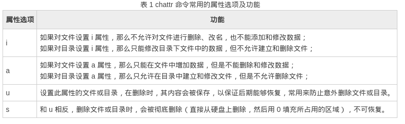

注释 <!--more--> # linux操作系统 > 操作系统:是一种软件，用来帮助其它的程序控制计算机硬件并和用户进行交互。 1. 应用程序也是一种软件，用来向计算机的用户提供某种服务，而不仅仅是控制计算机的硬件。 2. 操作系统的共同之处: * 引导计算机硬件，以便操作系统和其它软件程序可以正常工作。 * 为使用操作系统的程序分配系统资源，如内存处理时间。 * 跟踪同时运行的多个程序。 * 为所有使用系统设备的程序提供规范的访问借口。 3. 操作系统中主要的部分: * 内核:操作系统的核心，用来在多个应用程序之间分配计算机资源。 * 设备的驱动程序:是一个允许内核访问硬件设备(如键盘，鼠标，硬盘，扫描器或显卡)的软件 * shell:是一个可以通过用户输入的命令计算机进行处理的软件。 * 工具软件:管理软件和操作系统特性的软件。 * 图形用户界面:是一种软件，它是基于在鼠标这个接口之上的，用户可以通过这个接口在图形化应用程序可以使用菜单，* 按钮以及层叠窗口来进行操作。 * 完整的linux的系统: 1. 允许linux和外设一起工作的硬件驱动程序。 2. 图形化桌面坏境和管理操作系统的图形界面工具 3. 应用程序 4. 方便用户在计算机上安装所有linux文件的程序 5. 用于监视和配置系统功能的网络和系统管理工具。 ---- # 常用的linux命令 **因为我用的是manjaro-linux，不同的发行版所用到的命令是不一样的。这些在这里也没什么好说的，因为我也是一个小白。** **我觉得每个人的私密工作一定要做好，不然谁都可以顺起你的电脑造起来，这就不太好了。** 
* passwd (更换用户的密码)
* su + 用户名 (切换用户)
* passwd -l + 用户名  (锁定用户)
* passwd -S + 用户名  (解锁)
* sl--小骚(小火车)
* cmatrix(代码)
* ls--是查看当前目录的所有文件
* df--查看硬盘的空间 参数(-k -m -g)
* du -sh +目录 (查看目录的大小)
* swapon (查看分区的大小)
**在Linux里一却都是文件，我想这句话对我们来说都不陌生了。**
* touch + 文件名 (创建文件)
* rm + 文件名 (删除文件)
* grep (在文件中查找你想查找的内容)-n +(文件名)
* grep -vn + 文件名 (显示在文件里没要查找的内容) 
* -i(忽略大小写)
* -n(输出匹配的行号)
* -V(显示版本)
* -v(显示没匹配的内容)
* -o(只显示匹配的部分，不显示行号)
* -c(显示匹配的行的个数)
* -L(查询多文件时，只显示文件名)
1. ^(一行开始的标志)^big{匹配以big开头的行}
2. $(一行结束的标志)$big{匹配以big结束的行}
3. ?(匹配任意一个字符)big?yet{在两个字符中间匹配任意一个字符}
4. x\{m\}(重复x字符m次)x\{5\}匹配重复x字符5次的行
5. x\{m,\}(至少m次x字符)x\{5,\}匹配5次以上x字符的行
6. x\{m,n\}(m到n次的x字符)x\{1,10\}匹配1～10次x字符的行
7. [a-g] (查找a~g的字符)
* 格式   ---    grep "^abc" 文件名
----
# 管道符
> echo
1. echo "你好帅啊“ > a   //把输出的文字写进a文件里
2. man ls >>a          //把ls的手册以追加的形式写进a文件里
3. 假如在主目录里没有b文件
4. ls -l b 2> a         //把错误信息写进a文件里
5. ls -l b 2>> a        //和上面的意思一样
-----
# 比较文件 
> diff
* -a (以文本的形式比较两个文件)
* -q (只输出两个文件是否有差异，不输出其它)
* -s (比较两个文件是否相同)
* diff -u (可以把两个文件的比较内容)
* test(123)        test1(123456)  
//只是把test和test1文件的内容显示出来
* diff -u test test1 > file        
//把前面两个文件比较的内容写进file文件里
* patch -b test file           
//把以补丁的形式把原先缺少内容的test文件补回到我们想看的样子
>> cmp
**比较文件的命令，但一般用来比较文本文件，判断两个文件的不同之处，以及查看不同之处的位置**
----
* -l(显示两个比较文件每个不同点的字节号和字节数，前者十进制显示，后者八进制显示)
* -s(不显示错误信息退出)
* -v(显示版本信息)
>>> comm
* -1(显示文件1没有的内容)
* -2(显示文件2没有的内容)
* -3(文件1和文件2同时出现的内容不显示)
* -12(显示两个文件有的内容)
* -23(显示文件1有而文件2没有的内容)
* -123(什么内容都不显示)
**值得注意的是，comm比较的是排序的文件，显示出来的格式是以一行一行的形式输出的。**
----
# SHELL
**脚本是用户成功登录系统后启动，并始终作为用户与系统内核的交互接口。**
* 系统都有一个默认的脚本，我们也可以在终端用find /bin/sh*命令查看我们有那几种脚本。
* 我们也可以自定义文件的权限，以便实现文件的内容，简单点说就是脚本编程，通过改变文件的权限来把文件的实现。
# 基本目录的解析
**基本上每台linux电脑都会有一个名为家的目录，在linux下的一切都是以文件的形式存放在目录下的，我们还可以通过更改文件的权限来把文件里的内容效果实现出来，这说的就有点远了，让我们回到刚刚的目录，我们都知道文件是存放在目录下面的，所以想想都知道目录的重要性了。**
* / ---         根目录
* bin/ ---   存放必要的命令
* dev/ ---   存放设备文件
* etc/ ---   存放配置文件
* home/ ---   主目录(存放用户的数据)
* lib/ ---    存放必要的库
* mnt/ ---    存放挂载的目录(一般为空)
* root/ ---   超级用户的主目录
* proc/ ---   虚拟目录(内存的映射)
* sbin/ ---   存放用户经常使用的命令
* usr/ ---    存放应用程序和文件(内存最大的目录) 
----
# 文件权限
**权限分为数字权限和隐藏权限**
1. 数字权限 ---- 关键字--- chmod
* 权限分为可读，可写，可执行。数字表示分为4,2,1
* chmod 777  +文件名   更改文件的权限
2. 隐藏文件
* 关键字 --- chattr

* chattr +i 文件名
* 查看的命令 ----   lsattr +文件名
----
# 查找文件的命令
> find
**最大范围的查找文件，你也可以用这个命令来查找任何你想找的文件**
* 分为时间查找和文件大小查找和名字查找
1. 比如自己建立一个测试目录并名为Test/
2. 里面都是以t开头的文件名
3. 我们就是在这个目录下查找这些子文件
* find ./ -name t\* -ls
* -cmin -10(十分钟更改过的文件)
* -ctime -10(十小时更改过的文件)
* -amin -10(十分钟存取的文件)
* -atime -10(十小时存取的文件)
* -size +10k(查找大小为10k的文件)
**这里的用到了转义字符，不然系统会给我们报错的信息**
----
>> whereis
**用来看查找可执行程序和应用程序和手册**
* -b(只查找二进制文件)
* -B(在指定的目录下查找二进制文件)
* -f(使用-B参数，用来终止最后的目录)
* -u(查找不包含指定类型的文件)
