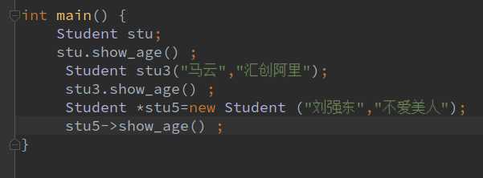
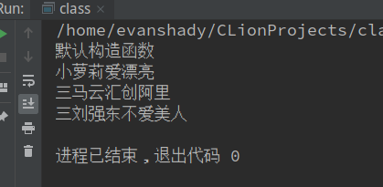
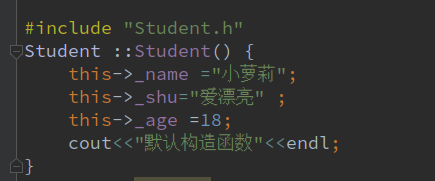
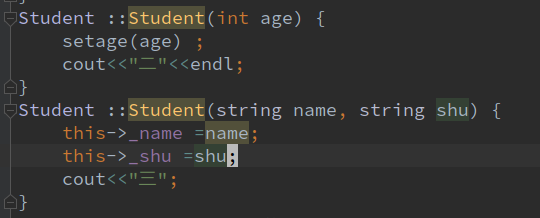
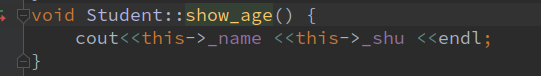
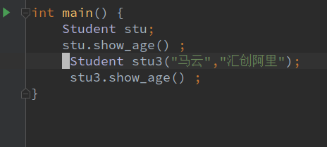
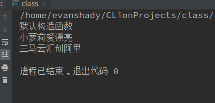

# 关于类的一些理解
----
## 1:类是面对对象的编程，它是以对象为基本来进行编程的。这样的说法就是安慰一些我们这些编程人也可以每天面对对象，仅此而已。
### 2:类有三种特性：封装,继承,多态。
> 类的封装，其实就是把成员变量设为私有的，也就是隐藏起来，然后再用方法/函数来实现你想要的结果。在类里面用set来进行封装，用get来返回。

----
#### 3:类还可以用指针来实现。用new在堆内存里申请一个空间，记得要用delete来释放空间！！！
**这里是用指针来new了一个空间，使用访问的时候也要用访问指针的方法来访问它，“->”**

----
##### 4:this指针，它可以访问类里面的所有成员变量和函数，（this->加成员变量/成员函数）
> 构造函数也可以叫做重载函数，它的作用是初始化类的成员变量。
>> 构造函数分为无参构造和有参构造；其实还有一个拷贝构造。
1. 无参构造函数，也叫默认构造函数，随你喜欢。还有就是，无参构造函数是计算机自动调用的，就算你没调用它，计算机也会自动帮你调用。

----
2. 有参构造函数，其实就是带参数的函数。

>>> 类里面的构造函数都是可以和show方法一起连用的，这样就可以看到构造函数无，有参之间的变化。

----

----

----
###### 5:析构函数其实是释放为指针成员变量的。比如你用指针new了一个新的成员变量，那在你程序完以后你得要释放它吧，总不能让它成为我们所畏惧的野指针，这时你就可以在析构函数里释放。