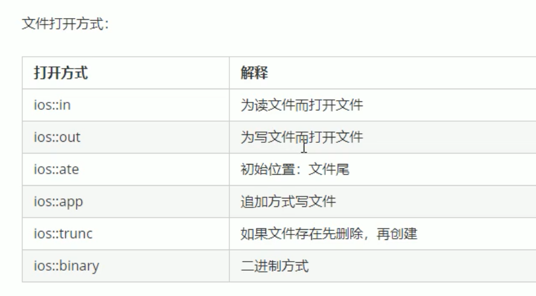
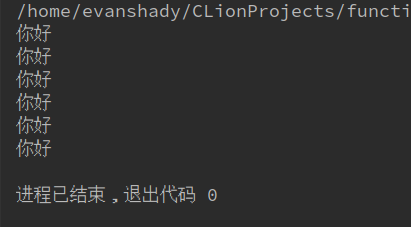

# 流
**c++中的流，可以让我们做很多我们想不到的操作，文件流，输入和输出流。**
1. 文件流的头文件(fstream)
2. 输入和输出流的头文件(istream)
* 把输入流当做函数的参数
```
#include <iostream>
using namespace std;
void test(istream &a){
    do{
    char A;
    cout<<请输入字符<<endl;
    a.get(A);//这里是以一个字符的形式输入
    cout.put(A);//是以字符串的形式输出
    }while(A!=' ');//把条件设为变量不能等于空格
}
int main(){
    test(cin);
}
```
运行结果
```
请输入字符
abc
abc
```
----
# 文件
> 文件有两种类型：
* 文本文件--以ASCLL码形式存储在计算机中。
* 二进制文件--以二进制写进计算机。
>> 分为三种类型：1.写文件（ofstream）,2.读文件（ifstream）3.（fstream）。
* 写入文件分为5大部分：
1. 先把写文件的头文件包含进去。
2. 然后确定你要写的文件的类型
3. 之后确定文件的名字和打开的方式
4. 把内容写进去
5. 关闭文件

```
#include<iostream>
#include<fstream>//引入写文件的头文件
using namespace std;
void test(){
    ofstream ofs;// 文件的类型 写入文件
    ofs.open("test.txt",ios::out);文件名和打开的方式
    ofs<<"你好！"<<endl;把你要写进文件的内容写进去
    ofs.close(); 关闭文件
}
void test1(){
    ifstream ifs;//文件类型，读文件
    ifs.open("test.txt",ios::in);//打开的文件名和打开方式
    if(!ifs.is_open()){//判断打开文件
        cout<<"文件打开失败"<<endl;
    }
    string buf;
    while(getline(ifs,buf)){//以一行的形式写入编译器并输出
        cout<<buf<<endl;
    }
    ifs.close();关闭文件
}
int main(){
    test();//调用test函数
    test1();//调用函数
}
```
## 对于写的内容追加到文件中的命令是如下：
```
#include <iostream>
#include <fstream>
using namestape std;
int main(){
    ofstream ofs;//声明文件的形式
    ofs.open("test",ios::app);//打开的方式
    ofs<<"你好"<<endl;//写进的内容
    ofs.close();//关闭文件
    ifstream ifs;//声明文件的形式
    ifs.open("test",ios::in);//打开的方式
    if(!ifs.isopen()){//判断文件的打开是否成功
        cout<<"文件打开失败"<<endl;
    }
    ifs.close();//关闭文件
}
```
* 在这里运行几次之后的结果会和第一次的不一样，因为在这里是以追加的形式向文件中写入你的内容。

# 用输出流来控制小数点
* 这里是用输出流来控制小数点的个数
```
#include <iostream>
#include <iomanip>//下面的函数会用到这个头文件
using namespace std;
int main(){
    double a(10.1234)
    cout<<a<<endl;
    cout.setf(ios::fixed);//小数点后的位数,默认为6个数位
    cout.setf(ios::showpoint);//打印小数点和小数点的个数，默认为6个数位
    cout<<a<<endl;
    cout<<setw(2)<<setprecision(2)<<a<<endl;//给出小数点后的几位数
    cout<<setw(6)<<a<<endl;
}
```
运行结果：
```
10.1234
10.123400
10.12
 10.12
```
# 四舍五入
* 简单的把数字四舍五入
```
#include <iostream>
#include <cmath>//在c++中有很多预定义的算术函数，都需要用到这个头文件
using namespace std;
int main(){
    double numb(0);
    int test(0);
    cout<<"请输入要四舍五入的数字："<<endl;
    cin>>numb;
    test=static_cast<int >(floor(numb+0.5));//把四舍五入后的数字强制转换成int类型
    cout<<test<<endl;
}
```
//简单的输出算术平方跟
```
#include <iostream>
#include <cmath>//c++与定义的函数调用
using namespace std;
int main(){
    double test(9.0),test1(0);
    test1=sqrt(test);//预定义平方跟函数
    cout<<test1<<endl;
    cout.setf(ios::fixed);
    cout.setf(ios::showpoint);
    cout<<setw(6)<<setprecision(2)<<test1<<endl;
    cout<<pow(3,2)<<endl;
    //pow函数，实现的是数字的几次方，前面的参数是数字，后面的参数是几次方,但函数返回的是double类性的数，因为我们上面把输出流设置成小数点后2位，本来的结果应该是9。
}
```
运行结果：
```
3
  3.00
9.00
```
**在c++中还有很多类似于写好的函数放在不一样的c++库中,这样的做法无非就是方便了我们这些短命子以后不用自己在写一遍实现的代码。比如我们经常用到的cin cout 这些都是放在一个库里面的我们需要的时候都是从iostrean库中的调用的。其实在这些里面还有很多很好玩的，比如上面用到的利用输出流来控制我们的变量输出格式，这些虽然看起来简单，但要我们代码来一一实现的话就有点小自闭了，也没什么必要这么做，因为现在都有现成的了，为什么不要？要是还想知道c++里还有哪些好玩的库，你自己以后慢慢寻找。** 
# 随机数字
**生成的随机数字的范围是1～6**
```
#include <iostream>
#include <cstdlib>//随机种子的头文件
using namespace std;
//自己选择数字的大小来实现随机数字的变化
void test(){
    srand(time(0));
    int a,b;
    cout<<"请输入最大的数字"<<endl;
    cin>>a;
    cout<<"请输入最小的数字"<<endl;
    cin>>b;
    if(b==0){
        cout<<(rand()%a)+1<<endl;
    }else{
        cout<<(rand()%a)+b<<endl;
    }
}
int main (){
    srand(time(0));//声明时间种子
    cout<<(rand()%6)+1<<endl;模6(得到的是0～5)+1(是把数字都加上1)
}
```
# 黑盒
* 也叫做函数的抽象化。