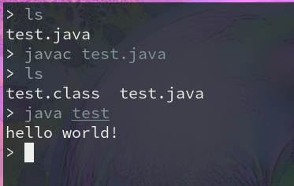
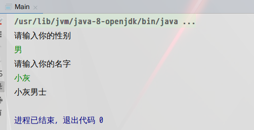
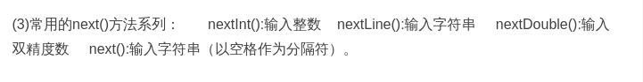
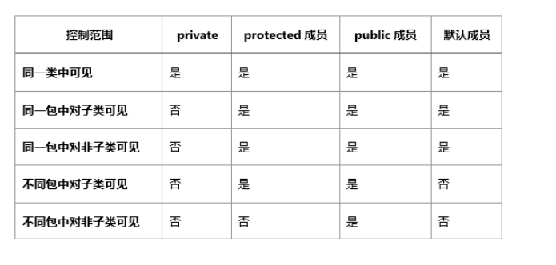
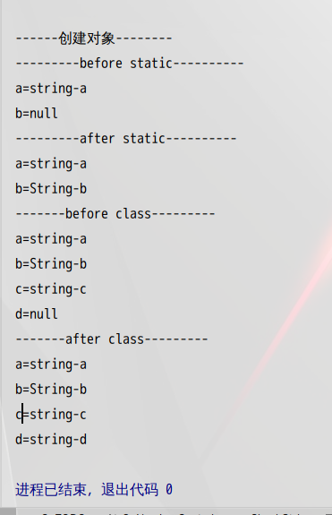

Write Once,Run Everywhere
 <!--more-->
 **达到对面向对象编程思想更加深入的理解，是对面向对象的各种特性及其实现细节更加熟练的掌握。** 
 ---

 *一步一个脚印的连好java的基本功。对于我来说是最好不过的，掌握java的基本语法。(类与对象，构造方法，引用传递，内部类，异常，包，java常用类库，javaIO，java类集)* 

1. 走技术之路(在学习java的同时，把基础的知识打好一定的基础)
2. 定位成为技术类管理成员(掌握基础的java知识，还要有几年的工作经验)
3. java软件开发发展前景好，移植性也很强。
- [ ] JDK(java开发工具包)

*是编程语言和javaAPI类库和java虚拟机(是完成移植性的重要机制)来组成的* 

- [ ] JRE(java运行时环境)
*是javaAPI子集和java虚拟机组成* 

**前面二者的区别是：JDK包含着JRE。如果仅仅是运行java程序的话就需要JRE。如果是要自己动手写java程序就要部署JDK环境。** 
---

**java系统可分为：javaEE(标准版)，javaSE(企业版)，javaME(微型版)，javaCARD(智能卡版)** 
---

```
//有必要说明一下，接下来的是在linux系统下使用终端来让我电脑上的文件进行运行

public class hello{//public(公有访问类型),class(类的标识),hello(类名)
    public static void main (String arg[]){//是main函数的基本格式,也表明main函数是静态方法
    System.out.println("hello,world!");//打印字符串"hello,world!"
    }
}
```
 
---


**这里要注意一下的就是文件的后缀是.java,其次是以javac 来作为第一次的关键字来操作文件，接着就会生成一个后缀为.class的文件，然后就是运行你写的文件，记住后面没有任何的后缀。** 

* **java是面向对象的过程，也就是说在java中只有方法而没有所谓的函数。** 

```
public class Test{
    public static void main(String args[]){
    scanner s=new scanner(System.in);//为了可以让用户输入，在这里使用了scanner类,因为它附属与System.in
    System.out.println("请输入你的性别");
    String set=s.nextLint();//以字符串的形式输入
    System.out.println("请输入你的姓名");
    String name =s.nextLint();
    switch(set){
    case "男":
    System.out.println(name+"男士");
    break;
    case "女":
    System.out.println(name+"女士");
    break;
    default :
    System.out.println("输入有误");
    break;
    }
    s.close();//关闭类
    InputStreamReader input=new InputStreamReader(System.in);//定义在键盘输入
    BufferedReader Buff=new BufferedReader(input);//以缓冲流的形式来接受input
    //用try和catch机制来处理异常
    try{
    System.out.println("请输入字符：");
    String s=Buff.readLine();
    System.out.println("字符："+s);
    }catch (Exception e){
    System.out.println("异常");
    }
}

```







*在这里只是简单的让用户输入了两次都是以字符串的方式来输入的，当然你也可以让用户输入你想让用户输入的数据类型(eg:int ,double)，上面也有参照的照片。* 

* **合法的标识符** 
- [ ] 不能存在关键字
- [ ] 首字母不能是数字
- [ ] 不能存在运算符
- [ ] 标识符是区别大小写的
- [ ] 标识符的命令规则是强制性的

`我们都知道数据的类型有int,short,float,double,byte(字节)。最常见的就是int(整形的数据类型)。在java中我们可以通过程序来输出各个数据类型的范围是多少，最大值和最小值，和数据类型
`

```
public class Test{
    public static void main (String args[]){
    int a=Integer.Size;
    System.out.println("int的范围:"+a);
    int b=Integer.MAX_VALUE;
    System.out.println("int的最大值:"+b);
    int c=Integer.MIN_VALUE
    System.out.println("int的最小值:"+c);
    Class <Integer> d=Integer.TYPE;
    System.out.println("数据类型:"+d);
    }
}
```

```
运行结果：
int的范围:32
int的最大值:2147483647
int的最小值:-2147483648
数据类型:int
```
---
```
public class Test{
            static int i=10;
    public static void main(String args[]){
            int a=1;
            int b=2;
            {
            int b=3;//main方法的变量名是不可以重复的，一个变量只能使用一个名，在这里就是重复使用了变量b，所以程序会报错。
            System.out.println("b="+b);
            System.out.println("a="+a);
            System.out.println("i="+i);
            }
            System.out.println("b="+b);
            System.out.println("a="+a);
            System.out.println("i="+i);

    }
}
```

```
上面的程序是运行不过的，这也是java的特别之处，在c++中，变量b是可以用的，但在java中是不可以的。
```
```
public class Test{
    public static void main (String args[]){
            char ch = '\"';//转义字符
            System.out.println(ch);
            System.out.println("\"hello,world!"\");
            System.out.println(ch+"hello,world!"+ch);
    }
}
```

```
运行结果
"
"hello,world!"
"hello,world!"
```
---

`总结可以得知，不管是用变量来存放转义字符，还是直接使用转义字符的方式来输出字符，程序都是可以顺利运行的，当然你也可以不使用变量来存放转义字符，但一个程序里面有太多的转义字符的存在你用变量来存放不是更好使用？这样你也不容易搞混已有的转义字符的使用。` 

```
public class Test{
    public static void main(String args[]){
        System.out.println(2+3+"k");
        System.out.println(6+6+"aa"+6+6);
    }
}
```

```
运行结果
5k
12aa66
```
---

`上面的2+3是一个表达式，所以这里是5,但后面跟的是字符和+(字符串相加)的符号，所以是5k,下面的也是一样的，唯一不一样的是在+(字符串相加)之后，计算机会自动认为后面的也是+(字符串相加)所以后面的就是12aa66。但如果把上面的双引号换成单引号就是以数字的形式先加后输出的。` 

# 数组
```
public class Test{
    public static void main(String args[]){
                int i=3;//这是在堆内存的分配的内存(也可以说是在编译是分配的),读取速度快，但数据的活动范围小(缺少灵活性)
                int y=new Integer(1);//是在栈内存分配的内存(也可以说是运行时分配的内存),读取速度慢，但数据灵活性高。
    }
}
```

```
public class test{
    public static void main(String args[]){
            Randow rand=new Randow();//声明随机数字的对象
            int []numb=new int [rand.nextInt(10)];//rand.nextInt(10)这句话的意思是随机生成一个0～10的数字作为数组的长度
            for(int i=0;i<numb.length;i++){//为数组赋值。从0～100来选择每次的赋值的数值
                numb[i]=rand.nextInt(100);
            }
            for(int a : numb){//打印数组里的元素
            System.out.println(a);
            }
           
    }
}
```

**在c++中的指针，在java是叫做引用数据类型，相当与c++中的地址指针** 
```
public class test{
    public static void main(String args[]){
    Randow rand=new Randow();//声明随机数字的对象
    int []a=new int[rand.nextInt(10)];//定义数组长度
    int []b=a;//把数组a赋值给数组b
    for(int i=0;i<a.length;i++){//为数组a赋值
            a[i]=rand.nextInt(100);
            System.out.println(a[i]);
            System.out.println(b[i]);
    }
    }
}
```

`上面程序的结果每次都是不要的，但值得注意的是输出的结果，肯定不会让你们失望的，因为数组b里面的元素是和数组a的元素是一样的。其实，上面最重要的一点就是数组b=数组a，它的等于是连着后面的a数组的赋值。` 

---

```
public class test{
    public static void main(String args[]){
            Randow rand=new Randow();
            int [][]numb=new int[3][1];//声明数组numb和给数组长度
            for(int i=0;i<numb.length;i++){//给数组赋值并输出数组里的元素
                for(int j=0;j<numb[i].length;j++){
                        numb[i][j]=rand.nextInt(10);
                        System.out.println(numb[i][j]);
                }
            }
    }
}
```

`一样的，上面的数组每运行一次程序的结果都是不一样的。` 

---
```
public class test{
    public static void main(String args){
            int []numb=new int[]{10,23,41,6,11};//声明一个数组，并赋初值
            int a=Randow rand=new Randow(3)+1;//生成随机数字，范围是1～4
            for(int i=0;i<a;i++){//把随机数字的大小作为条件,并从一开始交换位置
                int temp=numb[i];
                numb[i]=numb[i+1];
                numb[i+1]=temp;
            }
            for(int b:numb){//输出数组里的元素
            System.out.println(b);
            }

    }
}
```

`上面程序实现的是乱序，就是每次输出的结果都是不一样的。` 

---

# 对象
**类描述了对象的属性和对象的方法，类是对象的模板，更可以说，对象是类的实例，是一个实实在在存在的个体。所以说，面向对象的程序重要的是类的设计而不是对象的设计。** 
`类的声明格式:` 
- [ ] [标识符] class 类的名称
{
        //类的属性
        //类的方法
}
`类的标识符:` 
- [ ] 默认的(default):这个类只能被这个类的对象和同一个包中的其它的类访问，即使是其它包里的这个类的子类都不能被访问，它只认同一包里的类。

- [ ] 私有(private):如果一个方法或者属性被定义为私有的，那么只能在本类里访问它。

- [ ] 公有(public):如果一个方法或属性被定义为公有的，那么它不仅能跨类的对象所调用，还能在其它包中被访问。

- [ ] 保护(protected):如果一个方法或属性被定义为保护的，那么它能被本类的方法所访问，也能被子类所访问，即使子类在其它包里。

 

```
public class Test{
    public static void main (String args[]){
            System.out.println("------"创建对象"-------");
            new Apple();//匿名对象
    }
}
class Apple{
        static String a="string-a";
        Static String b;
        String c="string-c";
        Strint d;
        Static{//static 属于静态代码块，最先运行的是这段代码块，而不是类的构造函数先
                printstatic("before static");
                b="string-b";
                printstatic("after static");
        }
        static void printstatic(String name){//这里要加静态的关键字，因为调用是静态来的所以这里也要有静态的关键字来表明这里是静态，不然是会报错的。
                System.out.println("------"+name+"-------");
                System.out.println("a="+a);
                System.out.println("b="+b);
        }
        Apple(){
            print("before class");
            d="string-d";
            print("after class");
        }
        void print(){
                System.out.println("------"+name+"-------");
                System.out.println("a="+a);
                System.out.println("b="+b);
                System.out.println("c="+c);
                System.out.println("d="+d);

        }
}
```
 

```
上面的对象是经过匿名对象来实例化的，也就是没有给new的对象一个堆内存，一旦这句语句实现完，计算机会自动回收这个内存，将不再存在程序里，这也是java的垃圾回收机制(BC)，这也是为我们考虑的，不知道你有没有发现，上面的几个程序我都是用new来给类分配的对象，但我不但没有在类中写析构函数，也没有在main函数里delete对象的实例化。因为这一切都是java的BC机制帮我们做了。

```
public class Test{

    public static void main(String args[]){
            String name=new String ("java");
            String _name=new String ("java");
            String hua=_name;
            if(name==_name){
            System.out.println("地址相同");
            }else{
            System.out.println("地址不同");
            }
            if(name.equals(_name)){
            System.out.println("内容相同");
            }else{
            System.out.println("内容不同");
            }
}
运行结果:
地址不同
内容相同
```

上面的程序分别实现了字符串地址(==)和字符串内容(equals方法)的比较，第一个变量和第二个变量的是经过new来分配的栈内存的地址，所以输出的是地址不相同,而最后一个的是进行的内容比较，因为初始化的原因，这里也是输出的内容相同。


构造方法的注意事项
- [ ] 构造方法的名称与类的名称是一样的
- [ ] 构造方法也是和普通方法一样的，可以被重载，但构造方法的调用是通过在创建类的对象的时候自动调用的，这是与普通方法的调用是不一样的
- [ ] 构造方法是没有返回值的
- [ ] 构造方法是不能被static和final修饰的
- [ ] 构造方法是不能被继承的，如果子类要使用父类的构造方法只能使用关键字(super)来进行调用

```
public Test{

    private String name;
    Test(){
    System.out.println("类的无参构造方法的调用");
    }
    Test(String _name){
        this->name=_name;
        System.out.println("类的有参构造方法的调用");
    }
    public static void main(String args[]){
            new Test();//这是匿名调用类的构造方法
            Test test=new Test();//这和上面是等价的
            Test t1=new Test("小明");
    }
}

上面的程序做的只是简单的演示类的构造方法的重载。

```
public Test{
    public static void main(String args[]){
    Apple apple;
    apple=Apple.V();
    System.out.println("姓名:"+apple.name);
    }
}
class Apple{
        String name;
        private Apple (){
        name="hello";
        }
        private static final Apple APPLE=new Apple();
        public static V(){
        return APPLE;
        }
}
```

上面的程序的重要性是:当你不想一个类被频繁调用的是时候，可以通过对类的构造方法的私有化来实现


# 代码块
- [ ] 普通代码块(就是普通的放在Main方法里面的代码块)
- [ ] 构造代码块(放在类里面，比构造方法更先一步执行的代码块)
- [ ] 静态代码块(比构造代码块更快一步，如果和Main方法是放在同一个类的话，那它比Main方法更快一步执行)
- [ ] 同步代码块

> 普通代码块

```
public class Test{
        public static void main(String args[]){
        {int x=10;//普通代码块
        System.out.println("x");
        }//如果不要这个代码块，程序将会报错，因为在一个方法里，不能有同名的变量名
        int x=100;
        System.out.println("x");
}
}
```

```
运行结果为:
10
100
```

>> 构造代码块

```
public class Test{
    public static void main(String args[]){
           Peron p=new peron(); 
           Peron p1=new Peron("笑话");
    }
}
class Peron{
    private int x;
    String name;
    {
    System.out.println("构造代码块的调用");//这是构造代码块
    x=10;
    }
    Peron(){
        System.out.println("类的无参构造方法的调用\t"+x);
    }
    Peron(String _name){
    this->name=_name;
    System.out.println("类的有参构造方法的调用\t"+x);
    }
}

```
```
程序的运行结果为:
    构造代码块的调用
    类的无参构造方法的调用  10
    构造代码块的调用
    类的有参构造方法的调用  10
```

上面类中是有一块属于构造代码块，而它的速度比构造方法的调用都还快，以前我们只知道对于类来说，构造方法是第一个调用的，因为在我们声明类的对象的时候就是通过类的构造方法来实现的，但现在不一样的是，你只要在类中加个中括号({}),里面的代码实现比类的构造方法都还要快被实现，这使得我们的代码更简化一步。比如，就像上面一样，给一个成员变量复制，而不是通过它的构造方法来实现，你只需要定义一个变量，然后再加个({}),就能实现对成员变量的复制，速度还比类的构造方法快一布。

**由此我们可以知道，类的代码块中的初始化是一个类的所有构造方法都共有的“交集”部分，具有个性化的初始化还是要放在各自的构造方法里** 


>>> 静态代码块

```
public class Test{
    static {
    System.out.println("静态方法的调用");
    }
    {
    System.out.println("构造代码块的调用");
    }
    Test(){
    System.out.println("构造方法的调用");
    }
    public static void main(String args[]){
            System.out.println("创建第1个对象");
            new Test();
            System.out.println("创建第1个对象");
            new Test();
            System.out.println("创建第1个对象");
            new Test();
    }
}

```
```
程序的运行结果为:
    静态代码块的调用
    创建第1个对象
    构造代码块的调用
    构造方法的调用
    创建第2个对象
    构造代码块的调用
    构造方法的调用
    创建第3个对象
    构造代码块的调用
    构造方法的调用

```


**从上面的案例可以看出来，在执行时机上，静态代码块是在类加载的时候就会执行的，因为早于类的构造代码块和类的构造方法。当一个静态代码块和Main方法在同一个类中，Main方法的调用也是在静态代码块的后面的。静态代码块的执行级别是最高的。**    


```
public class Test{
    public static int [] show(int []numb){
        numb[0]=10;
        numb[1]=12;
        numb[2]=13;
        return numb;
    }
    public static void show1(int []numb){
        for(int i:numb){
        System.out.print(i+"\t");
        }
    }
        public static void main(String args[]){
            int [] numb =new int{1,2,3,4,5};
            for(int i:numb){
            System.out.print(i+"\t");
            }
            System.out.println();
            System.out.println("--------------");
            show(numb);
            Show1(numb);

    }
}
```

```
    程序的运行结果为:
    1 2 3 4 5 
    10 11 12 4 5
```

`上面的程序只是简单的利用java的特性用新的方式来打印数组，只需要一个变量来操作数组对象就行了，比我们之前在c++中的方式简便多了，也是代码的量也减少了，这无疑是一件好事，还利用了引用数据类型来实现对数组的操作，更加利用了静态方法来进行对数组里的元素更改。` 


