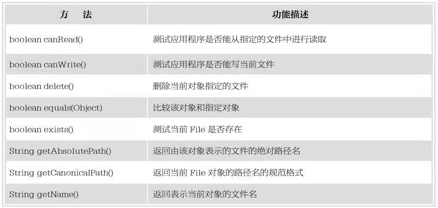
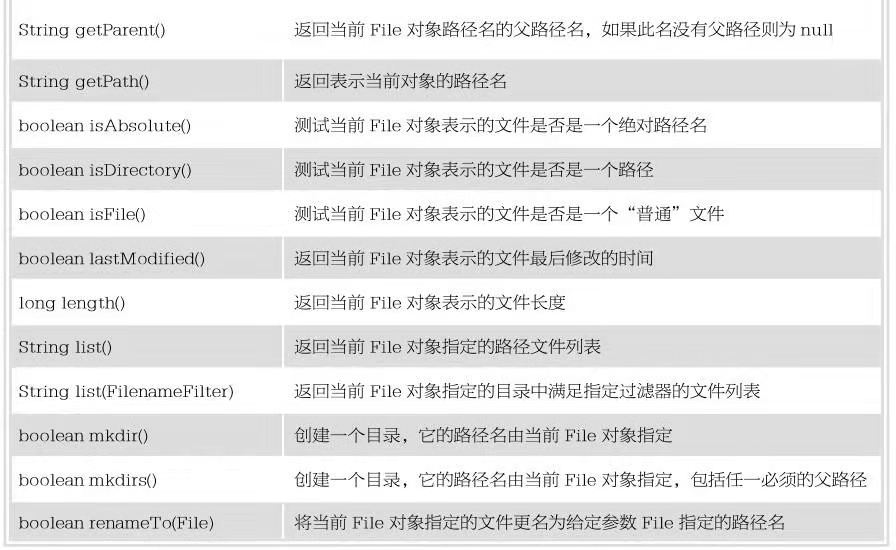

Write Onec,Run EveryWhere
<!--more-->
                                                        Java
# I/O
当程序需要读取数据时，就会开启一个通向数据源的流，这个数据源可以是文件，内存，也可以是网络连接。而当程序需要写入数据时，也会开启一个通向目的地的流，这时，数据就可以想象成为管道中“按需流动的水”。流作为操作各种物理设备提供了一致的接口，通过打开将流关联到文件，通过关闭流操作和文件解除关联。


```
public class Test{
    public static void main(String [] args){
            File me=new File("Desktop/test.txt");
            if(me.exists()){//判断是否有这个文件
                me.delete();//删除这个文件
            }else{
                try{
                me.createNewFile();//如果没有这个文件则创建
                }catch(Excepion e){
                    System.out.println(e.getMessage());
                }
            }
            System.out.println(me.getName());//获得文件的名字
            System.out.println(me.getPath());//获得文件的相对路径
            System.out.println(me.getPaernt());//获得文件的目录
            System.out.println(me.getAbsolutePath());//获得文件的绝对路径
            System.out.println(me.canWrite?"可以写":"不能写");//判断文件是否能写
    }
}
```

```
运行结果:
没有那个文件或目录
test.txt
Desktop/test.txt
Desktop
/home/evanshady/Desktop/test.txt
不能写


```

上面的程序是利用File类的一些操作，File类中还有其它的方法，在这里就不一一实现了，File类只能对文件的一些小操作(创建，删除，更名)，对文件的读写操作是不能的。

 
 

**在java中对于文件的操作有两大流，字节流和字符流。一般来说音频，视频，图像，不管是写入或者读取我们需要使用字节流来比较方便，相当与文本而言就是字符流比较合适。对于文件的写操作(Outputstream),读操作(Inputstream)** 

```
public class Test{
    public static void main(String [] args){
            File file=new File("/home/evanshady/Test/test.txt");//文件路径
            Outputstream out=null;//文件的写入流
            try{
                out=FileOutputStream(file);//将文件流和指定的文件连在一起
            }catch(FileNotoutputstream e){
                file.createNewFile();//利用错误机制来获得信息，如果没有这个文件，将会在文件的相对路径创建文件
                e.printStackTrace();//打印错误的信息
            }
            byte []a="hello,world!".getBytes();//将要写入的字符，转换成字节
            try{
            out.write(a);//写入字节
            }catch(IOException e){//利用错误机制，如果没有写入的字符将会打印错误信息
            e.printStackTrace();
            }
            try{
            out.close();//关闭文件流
            }catch(IOException e){//利用错误的机制，如果文件没有被关闭将会打印错误的信息
            e.printStackTrace();
            }
            Inputstream in=null;//定义读文件流
            try{
            in=new FileInputstream(file);//将读文件流和指定的文件连接在一起
            }catch(FileNotoutputstream e){//利用错误机制,如果没有这个文件，将会打印错误的信息
            e.printStackTrace();
            }
            byte [] a1=new byte[1024];//定义一个字节数组
            int i=0;//定义一个变量
            try{
            i=in.read(a1);//读取文件里的内容
            }catch (IOException e) {
                e.printStackTrace();//利用错误机制，如果读取文件内容失败，将会打印错误的信息
            }
            try{
            in.close();//关闭文件流
            }catch(IOException e){
            e.printStackTrace();//利用错误的机制，如果文件没有被关闭将会打印错误的信息
            }
            System.out.println(new String(a1,0,i););//利用String来将读取到的内容打印出来

    }
}
```

```
运行结果:
hello,world!
```


上面的程序是利用File类和OutputStream和Inputstream三个类来实现的文件操作，其细致的操作说明在上面已经有详细的注释了。上面的程序值得注意的是千万不要忘记了将文件的写入流||输出流和指定的文件连接在一起，不然你拿什么来操作，还有就是关于连接以后，你可以在后面加个true来看看指定文件的内容是什么样的。

```
public class Test{
    public static void main(String [] args){
            File me=new File("/home/evanshady/Test/a.txt");//指定的文件
            Writer writer=null;//定义文件的写入流
            try{
            writer=FileWriter(me);//将文件的写入流和指定的文件连接
            }catch (FileNotoutputstream e){
            me.createNewFile();//利用错误机制来获得信息，如果没有这个文件，将会在文件的相对路径创建文件
            e.printStackTrace();
            }
            String a="hello";//定义要写入的字符串
            try{
            writer.write(a);//利用错误机制，如果没有写入的字符将会打印错误信息 
            }catch (IOException e){
            e.printStackTrace();
            }
            try{
            writer.close();//利用错误的机制，如果文件没有被关闭将会打印错误的信息
            }catch(IOException e){
                e.printStackTrace();
            }
            int x=0;定义一个变量，初始化为0
            x+=me.length();//将指定的文件的大小赋值给变量
            char [] b=new char[x];//定义一个数组,数组的大小正好接住从文件读取的内容
            int i=0;//定义一个变量，来配合读文件的方法
            Reader reader=new Reader(me);
            try{
                i=reader.read(b);
            }catch(IOException e){
            e.printStackTrace();
            }
            try{
            reader.close();
            }catch(IOException e){
            e.printStackTrace();
            }
            System.out.println(new String(b,0,i));//将读取的内容打印出来
    }
}
```

```
运行结果:
hello
```

writer类和reader类是Outputstream的子类，此类是字节流和字符流的转换类，而字符流和字节流不同的是，字符流多了一个缓冲区，而字节是没有缓冲区的，直接对文件实时操作。

```
public class Test{
    public static void main(String [] args){
            BufferedReaber reader=new BufferedReaber(new Inputstream(System.in));//定义一个字符流连接着键盘输入流
            String str=null;//定义一个字符串
            System.out.println("请输入一个数字");
            while(true){//利用循环
                try{//错误机制
                str=reader.readLine();//字符串来接住输入的那个数字
                }catch (IOException e){//通过流来检测错误信息
                    e.printStackTrace();
                }
                int i;//定义一个变量
                try{
                    i=Integer.parseInt(str);//将输入的字符串转换成整形，
                    i++;//更改变量的值
                    System.out.println("数字更改后:"+i);//打印
                    break;//循环结束
                }catch(Excepion e){
                    System.out.println("数字不对,请重新输入");//利用错误来检测输入的是否是整数
                }
            }
    }
}
```

```
运行结果:
请重新输入一个数字
10
数字更改后：11
```


# 管道流
**它具有将一个程序的输出当作另外一个程序的输入功能。在java中，它的I/O系统是建立在数据流概念之上，也可以使用管道流进行线程之间的通信，在这个机制中，输入流和输出流必须要相连接，这样的通信有别于一般的共享数据缓冲区通信，其不需要一个共享的空间** 

管道流也分为字符流和字节流

```
public class Test{
    public static void main(String [] args){
            One one=new One();//
            Two two=new Two();
            PipOutputstream out=new one.getout();
            PipInputStream in=new two.getin();
            one.connect(two);
            one.start();
            two.start();
    }catch (IOException e){
    System.out.println(e.getMessage());
    }
}
class One extends Thread{//继承管道类
            private PipOutputstream out=new PipOutputstream();//定义一个写入的管道流的对象
            public PipOutputstream getout(){//返回管道类的对象
            return out;
            }
            public void run(){
                String str="hello,world";//要写入的字符串
                try{
                out.write(str.getByte());//通过字符串的转换方法，将要写入管道流的字符串转换成字节
                out.close();//管道关闭
                }catch(IOException e){
                System.out.println(e.getMessage());
                }
            }
}
class Two extends Thread{
            private  PipInputStream in =new PipInoutputStream();//定义一个读出的对象
            public PipInoutputStream getin(){//返回管道类对象
            return in;
            }
            public void run(){
                String str;
                byte []bytes=new byte[1024];
                try{
                int len=in.read(bytes);//通过读出的对象的读方法
                str=new String(bytes,0,len);
                System.out.println("得到的信息："+ str);
                in.close();
                }catch(IOException e){
                System.out.println(e.getMessage());
                }
            }

}
```

```
运行结果:
得到的信息：hello，world
```

上面的程序是通过两个类来集成Thread类来定义两个不一样的管道流(输入管道流&&输出管道流),分别重写Thread类中的run方法，使其各自做各自的事情(写入&&读出),然后再在main方法里通过自己重新定义的PipOutputstream对象&&PipInputstream对象来接住刚刚自己写的两个类的对象，然后就是将这两个对象连接在一起(connect),再就是给两个对象都开启线程，就是我们想要的的线程工作，最后不要忘记把写和读的过程中添加在错误机制里面来测试。


# 文件连接
```
public class Test{
    public static void main(String [] args){
            File file=new File("/home/evanshady/Test/a.txt");//声明第一个文件           
            Inputstream in=new FileInputstream(file);//让第一个文件和声明的文件流连接在一起
            File File1=new File("/home/evanshady/Test/test.txt");//同上
            Inputstream in1=new FileInputstream(file1);//同上
            SequenceInputstream s=new SequenceInputstream(in,in1);//定义一个合并文件的变量把文件1和文件2作为参数放在里面
            File file2=new File("/home/evanshady/Test/b.txt");//定义第三个文件
            int i;
            try{
                while((i=s.inread())!=-1{//通过合并的变量和read方法来读进内容
            Outputstream out=new FileOutputStream(file2);//第三个文件和文件流连接在一起
            out.write();//第三个文件的写方法
                        }
                        in.close();//关闭文件流
                        in1.close();//关闭文件流
                        s.close();//关闭文件流
                        out.close();//关闭文件流

            }
    }
}
```

```
运行结果:
hello.hello,world
```

上面的程序是让两个文件先通过SequenceInputstream来连接在一起，在这里的前提是前两个文件是要先确定有的，后面的通过文件流的读把要读进的内容通过第三个文件的write方法来写进去。


# 打印流(PrintWrite)
```
public class Test{
    public static void main(String args[]){
            PrintWrite out=new PrintWrite(System.out);//输出流
            out.write("hello");//把内容写在输出流
            out.close();//关闭输出流
            File file=new File("/home/evanshady/Test/a.txt");//文件
            PrintWrite out1=new PrintWrite(new FileWriter(file));//通过打印流来连接一个输出流
            out1.print("me");//把内容写在输出流里
            out1.close();//关闭输出流

    }
}
```

```
运行结果:
hello

```

上面的程序主要是通过输出流来把内容分别输出在屏幕上和写进文件里


# 读文件里的多行内容(BufferedReaber)

```
public class Test{
    public static void main(String []args){
            File file=new File(/home/evanshady/Test/a.txt);//文件的路径
            /*
            BufferedReaber in=new BufferedReaber(new FileReder(file));//将读文件的变量和文件流连接在一起
            Stream<String> lin=in.lines();//lines的方法调用的返回值是(字符流)类型
            lin.foreach((L)->System.out.println(L));//将上面的字符流对象通过foreach来将内容打印在屏幕上
            in.close();//将文件流关闭
            */
            List<String> list=Files.readAllLines(file.toPath());//通过列表来调用文件里的readAllLines方法来把文件.toPath来作为参数，将文件里的内容都放在列表里
            for(String a:list){
            System.out.println(a);
            }
    }
}

```
上面的程序主要是将文件中多行内容通过lines的方法放在流里，然后在通过foreach方法来将流里的内容打印在屏幕上。后面的方法也是一样的行为，只是方法的类型和方法的名字不一样而已，后面那个方法有点自闭的就是字体要utf-8在能读对，不然会有一些奇怪的字符出现


# 对象的写文件(Serializable)
```
public class Test{
    public static void main(String [] args){
        File file=new File("/home/evanshady/Test/a.txt");
        w(file);
        r(file);
    }
    public static w(File f){
        Outputstream out=new Outputstream(f);
        ObjectOutputstream ob=new ObjectOutputstream(out);
        ob.writeobject(new A("张三",1000));
        ob.close();
    }
    public static r(File f){
        Inputstream in =new Inputstream(f);
        ObjectInputstream ob=new ObjectInputstream(in);
        A a=(a)ob.readobject();
        System.out.println(a);
        ob.close();
    }
}
class A implements Serializable{
        private String name;
        private int i;
        A(String _name;int _i){
        this->name=_name;
        this->i=_i;
        }
        public String toString(){
        return "姓名为："+this->name+"工资为："+this->i;
        }
}
```

```
运行结果:
姓名为：张三工资为：1000
```

上面的程序只是简单的把类的属性值写进文件里，但你要是不想要类中的某个属性值的时候只需要在类中的元素关键字前面加上transient就能把这个属性值不放进文件里
