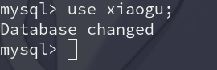

                                       数据库
<!--more-->
# 第一节(数据库系统概述)
1. 数据(date)
* 是描述事物的符号记录，是指用物理符号记录下来的，可以鉴别的信息。
---
2. 数据库(DB)
* 存储数据的仓库。
> 特点
* 永久储存，有组织，可共享。
----
3. 数据库管理系统(ABS)
* 专门用于建立和管理数据库的软件，以及提供必要的安全性和完整性。
> 功能
1. 数据定义功能
2. 数据操纵功能
3. 数据库的运行管理功能
4. 数据库的建立和维护功能
5. 数据有组织,存储和管理功能
6. 其他功能(通信功能，不同数据库之间数据的相互共享)
----
4. 数据库系统(DBS) ----  数据库管理员(DBA)
# 第二节(数据管理技术的发展)
* 应用程序管理数据
*特点* 
* 数据面向应用
----
2. 文件管理系统
*特点* 
* 数据可长期存放在磁盘
* 数据的逻辑结构与物理结构有了区别
* 文件组织呈多样化
* 对数据的操作以记录为单位
* 数据不再属于某个特定的程序可重复使用
----
3. 数据库系统阶段(E,F,code)
*重大事件* 
* 1968年 美国IBM公司 (层次模型)
* 1969年 美国 codesy (网状模型)
* 1970年 美国 EFcode (关系模型)
*特点* 
1. 数据集成
2. 数据共享性高
3. 数据冗余小(文件系统的缺陷)
4. 数据一致性(文件系统的缺陷)
5. 数据独立性高(文件系统的缺陷)
*数据库保护* 
1. 数据的安全性
2. 数据的完整性
3. 并发控制
4. 故障恢复
# 第三节(数据库系统的结构)
1. 三级模式的结构
  外模式(子模式和用户模式)
* 模式(概念模式和逻辑模式)
* 内模式(存储模式)
* 两层映像
1. 外模式和概念模式(多个)
2. 逻辑模式和内模式(唯一一个)
----
2. 数据库系统的运行与应用结构
* 用户与服务器结构(C/S)
* 浏览器与服务器结构(B/S)

# 第四节(数据模型)
## 1. 数据模型的组成要素
1. 数据结构(静态特征)
2. 数据操作(动态特征)
3. 数据约束(依存关系)
### 2. 数据模型的分类
*概念层数据模型* 
* 概念层是数据抽象级别的最高层，其目的是按用户的观点来对世界建模。
* 可分为：
1. 实体：客观存在相互区别的食物。
2. 属性：实体所具有的某种特性。
3. 码或键：唯一标识实体的属性集。
4. 域：属性的取值范围。
5. 实体性：具有相同属性的实体必然具有共同的特征和性质。
6. 实体集：同型实体的集合。
7. 联系：事物内部和事物之间是有联系的。
* 概念模型的表示方法（1：1 ; 1：n ; n:n）
*逻辑层数据模型* 
1. 层次模型(使用最早)
2. 网状模型(复杂)
3. 关系模型(二维表结构，使用最广)
4. 面向对象模型
*物理层数据模型* 
* 定义：描述数据在介质上存储，是逻辑模型的物理实现。
1. 概念模型到逻辑模型的转换是由数据库设计人员完成的。
2. 逻辑到物理是由数据库管理系统完成的。
----
# 第二章 关系数据库
**第一节关系数据库概述**
----
* 特征：是使用关系数据模型来组织数据。(主流数据模型)

**第二节关系数据模型**
----
1. 关系数据结构
* 表：被称为关系，是一个二维表(由表名，构成表的各个列和数据组成)。
* 关系：可分为三种关系，(基本关系，查询表，视图表)。
* 列：被称为字段或属性。
* 属性：和列是同一个意思。
* 行： 被称为元组或记录。
* 元组：
* 分量：元组中的每一个属性值。
* 码或键()
---

**关系操作集合**
1. 查询操作可以分为：选择，投影，连接，除，并，差，交，笛卡尔积，其中选择，投影，并，差，笛卡尔积是五种基础的，(增，删，改，查，插)。
2. 关系数据语言的分类
* **结构化查询语言**(SQL)
* **数据定义语言**(DDL)
* **数据操纵语言**(DML)
* **数据控制语言(DCL)**
3. **关系的完整性约束**
* *数据库的数据完整性是指：数据库中的数据的正确性，相容性，一致性。*

1.*关系模型中有三类完整性约束：实体完整性约束，参照完整性约束，用户定义完整性约束，其中(实体完整性约束和参照完整性约束是关系的两个不变性)。*
* **实体关系完整性约束是指：关系的主属性，即主码的组成不能为空。**
* **参照完整性约束是指：定义在主码和外码之间的引用规则。**
* **用户定义完整性约束：是针对某一应用环境的完整性约束条件。**
---

**关系数据库的规范化理论**

*关系模式中可能存在的冗余和异常的问题*
* 数据冗余
* 更新异常
* 插入异常
* 删除异常

**数据依赖(函数依赖与关键字)**
---
- [ ] 函数依赖与关键字
* 函数依赖分为：完全函数依赖，部分函数依赖，传递函数依赖。
- [ ] 范式与关系规范化过程

**规范化：一个低一级范式的关系模式通过模式分解可以转换为多个高一级范式的关系模式的集合** 

**规范化的优点：** 

1. 大大减少了数据冗余
2. 改进了数据库整体组织
3. 增强了数据的一致性
4. 增加了数据库的设计性
* 第一范式(列的字段名不可再分)
* 第二范式(必须满足于一范式，表中非主键列必须完全依赖与任意一个主键位)问题：插入，删除，更新异常，数据冗余。
* 第三范式(必须满足于第二范式，每个非主键位列与主键不存在传递依赖而是完全依赖)
* BCNF(必须满足三范式，消去了主属性对键的传递函数依赖)
---

**数据库操作是在终端下运行的。** 
* 首先是要下载mysql来进行我们的操作
* 然后就是一些mysql的基本操作了
---

// 进入到mysql
mysql -u root -p

// 接下来只需要输入你的密码就行了
password:

// 接下来我们就可以直接使用命令来做我们想做的一些基本操作了
// 显示数据库
show databases;
 

// 创建你自己的数据库
create database xiaogu(数据库名);

// 显示一下数据库
show databases;
 

// 删除自己创建的数据库
drop database xiaogu;(数据库名)

show databases;
 

use xiaogu(更换数据库)
 

// 接下来是对表进行操作了
create table xsb(id int(11)not null,name varchar(3),qq int(11));

desc xsb;

insert into xsb values(214242,'小灰',24441444);

select * from xsb;// 将列出表里的所有属性的参数
select * from xsb limit 1;// 将表里的所有属性的参数值限制只输出一行
select distinct name from tablename; //将列出表里的属性名的不同参数

 

//更改表名
rename table xsb to 学生表;

 

// 在表里添加参数
alter table xsb add phone int(11);

// 在表里修改参数
alter table xsb change id _id int(11);

// 在表里删除参数

alter table xsb drop id;

// 删除表里的主键
alter table (tablename) drop primary key;

// 恢复表里的主键;
alter table (tablename) add primary key (表里的主键属性名)

// 先创建表格
create table test(name char not null,id int not null auto _ increment,
primary key (id);

// 删除表里的主键,先删除表里的自动增长列
alter table test modify id int;

// 现在才能删除表里的主键
alter table test drop primary key;

// 恢复表里的主键;
alter table (tablename) add primary key (表里的主键属性名)

**创建一个表来进行演示** 

create table test (name char not null,id int not null primary key,phone int not null);

insert into table test values ('笑话',1,110);

# select 

// 查看表里全部属性值(test/表)
select * from test;

// 查看表里指定的属性值(id)
select id from test;

// 以排序的方式来输出全部属性值(order by(默认的排序方式是自动排序))
select * from test order by id;

// 以逆序的方式输出全部属性值
select * from test order by id desc;

// 以排序的方式限制的输出结果(where(限制))
select * from test where id!=0 order by id;

// 以排序的方式输出id不为1,5的表里所有的属性值
select * from test where id not in (1,5) order by id;

## 通配符(% _ )
* 前面的介绍都是在已知值进行搜索的,在很多情况下我们都是在不知道属性值的情况下来寻找相应的字段
* 通配符是用来匹配值的一部分的特殊字符
* 是由字面值和通配符或两者组合构成的搜索条件

// (%)它将匹配数字前面或后面的多个字符
select (属性值) from (表名) where (属性) like '%';

// ( _ )它只匹配属性值的一个元素
select (属性值) from (表名) where (h属性值) like ' _ ';

- [ ] 不要过度使用通配符，如果其他操作符能达到相同的目的，应该使用其他操作符

- [ ] 在确实需要通配符时，除非绝对有必要，否则不要把它们用在搜索模式的开始处，搜索起来是最慢的

- [ ] 仔细注意通配符的位置，如果放错了地方可能返回的不是想要的结果

**总之，通配符是一种及其重要和有用的搜索工具，以后我们会经常用到**

### 正则表达式

// 找到phone属性值为1在最前面的id和name

select id ,name from test where phone regexp '1.';

* 上面的句子和like '1%'的输出格式是一样的
