# Qt
*图形化界面--GUI。这个工具对于程序员的开发是便利的，特别是开发用户的图形化界面，在Linux里也是用到了qt的。*
----
```
#include <QApplication>//使用qt的头文件
#include <QWidget>//窗口控制基类
#include <QPushButton>//指定父对象的头文件
int main(int argc,char *argv[]){
        QApplication  a(argc,argv);
        My_widget w;
        w.setwindowTitle("主要看气质");//文件头名
        QPushButton b;//声明按钮的类     
        b.setParent(&w);//让按钮放在父对象的函数
        b.setText("删除");//声明按钮,并赋值
        b.move(100,100);//移动按钮
        QPushButton b1(&w);//使用按钮构造函数并指向父对象
        b1.setText("确认");//声明按钮,并赋值
        b1.move(200,200);//移动按钮
        w.show();//输出函数
        return app.exec();
}
```
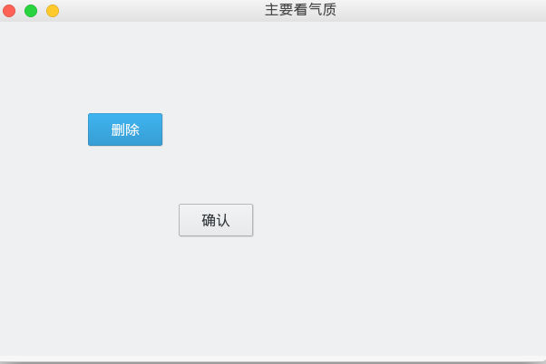
**值得注意下的就是，如果不给按钮对象指向父对象，两个窗口是独立的。还有上面是用了两种方式来指向父对象，一个是用函数setParent(),另外一个是用构造函数来指向。**
```
#include <QApplication>
#include <QWidget>
#include <QLabel>
int main(int argc,char *argv[]){
            QApplication a(argc,argv);
            QLabel label("Hello");
            return a.exec();
}
```
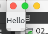
**上面的代码有点不好，但要是一定要这样的话，那在main函数里面的代码是很多的。这样让别人看起来就有点不好的感觉。**
**QPushButton--是按钮，QWidget--是窗口**
* signals--信号(类似与广播，发出信号，如果有对它有意思的，就有connect连接，来把它连接在一起)
* connect--连接(意思是，用自己的函数(成为槽(solt))来处理这个信号)
```
//练练手，长长记性
//main函数里面的头文件
#include <QApplication>
#include <QPushButton>
#include "My_Widget.h"

//是以公有的方式继承了窗口化的类,.h文件
#include "sud.h"
class My_Widget:public Widget{
public:
        My_Widget(QWidget *parent =nullptr);
        ~My_Widget();
        void showb2();
        void showwid();
        void showxin();
private:
        QPushButton b1;
        QPushButton *b2;
        QPushButton b3;
        sud s;
}
//.cpp文件
#include "My_Widget.h"
My_Widget::MyWidget(QWidget *parent =nullptr):QWidget(parent){
        b1.setParent(this);
        b1.setText("^_^");
        b1.move(100,100);
        b2=new QPushButton (this);
        b2->setText("abc");
        connect(&b1,&QPushButton::released,this,&QPushButton::close);
        connect(b2,&QPushButton::released,this,&My_Widget::show);
        s.show();
        this->setWindowTitle("老大");
        b3.setParent(this);
        b3.setText("切换子窗口");
        connect(&b3,&QPushButton::released,this,My_Widget::showwid);
        connect(&s,&sud::xin,this,&My_Widget::showxin);//接收信号并处理信号
        resize(400,300);
        //当信号发出时，被连接的槽函数会被回调用来处理信号发出的操作
}
void My_Widget::showb2(){
        b2->setText("123");
}
void My_Widget::showwid(){
        s.show();
        this->hide();
}
void My_Widget::showxin{
        this->show();
        s.hide();
}

//是以公有的方式继承My_Widget类的派生类
#include <QWidget>
#include <QPushButton>
class sud : public My_Widget{
public:
        explicit*** sud(QWidget *parent =nullptr)
        void showwid();//用来发射信号的函数
signals:
        void xin();//信号
private:
        QPushButton b;
}
void sud::sud(QWidget *parent):QWidget(parent){
        this->setWindowTitle("小弟");
        b.setParent(this);
        b.setText("切换父窗口");
        connect(&b,QPushButton::clicked,this,&sud::showwid);//发送信号的
        resize(400,300);
}
void sud::showwid(){
        emit xin();
}


int main(int argc,char *argv[] ){
        QApplication a(argc,argv);
        My_Widget w;
        w.show();
        return a.exec();
}
```
**槽**
1. 任意的成员函数，普通全局函数，静态函数
2. 槽函数需要与信号一样(返回值和参数)由于信号没有返回值，所以槽函数也没有返回值
**信号**
1. 信号必须有关键字signals
2. 信号没有返回值，是个函数,可以有参数
3. 信号只有声明，无需为信号定义
4. 使用的方法:使用关键字emit来调用
* 按钮只是回调了槽函数，而窗口的所有改动都是该窗口改变的，和按钮是没什么关联的。
**内存**
1. 指定父对象后,直接或间接的继承于Q0bject
2. 子对象如果动态分配空间(new)，不需要手动释放(delete)，系统会自动调用析构函数
```
#include <QMenuBar>//菜单栏
#include <QMenu>//菜单
#include <QAction>//控件
#include <QToolBar>//快捷键
#include <QDebug>//打印
#include <QStatusBar>//状态栏
#include <QLabel>//标签
#include <QTextEdit>//核心控件
#include <QDockWidget>//浮动窗口
* 创建菜单栏和一些控件
* 以下的代码是在构造函数的里面的，主要是懒得写了。
        QMenuBar *mbar=menuBar();//声明一个菜单栏
        Qmenu *f1=mbar->addAction(文件);//在菜单栏里写一个以文件为名的控件
        QAction *p1=f1->addAction("新建");//在文件里写一个以新建为名的控件
        connect(p1,&QAction::triggered,//槽函数
        []()
        {
                qDebug()<<"新建被按下";
        });
        f1->addSeparator();//分割线
        QAction *p1_2=f1->addAction("打开");//同上
        Qmenu *f2=mbar->addAction("编辑");
        QAction *p2=f2->addAction("编辑");
        connect(p2,&QAction::triggered,
        []()
        {
                qDebug()<<"编辑被按下";
        });
        QStatusBar *sbar=statusBar();//状态栏，声明状态栏
        QLabel *label= new QLabel (this);//声明标签
        sbar ->addAction(new QLabel("2",this));//以从左往右的方式显示2
        sbar-> addPermanentWidget(new QLabel("3",this));
        //以从右忘左的方式显示3
        QTextEdit *text=new QTextEdit(this);//核心控件，也就是文件编辑的地方
        setCentralWidget(text);
        QDockWidget *dock=new QDockWidget(this);//浮动窗口
        addDockWidget(Qt::LeftDockWidget,dock);//在左边显示
        QTextWidget *text1=new QTextWidget(this);//声明编辑
        dock->setWidget(text1);//在浮动窗口里显示文件编辑的地方

```
----
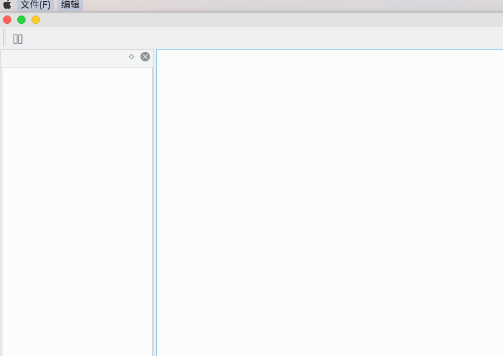
# 关于对话框
----
* 是在继承于MainWindow(主窗口)的类构造函数里
```
#include "QMainWindow"//继承与主窗口
#include <QMenuBar>
#include <Menu>
#include <QAction>
#include <QDebug>
#include <QMessageBox>//对话框的头文件
#include <QFileDialog>//查找文件的对话框的头文件
MainWindow::MainWindow(QWinget *parent)
        :MainWindow(parent){
                QMenuBar *menub=menubar();
                QMenu *p1=menub->addmenu("文件");
                QAction *A1=p1->addaction("关于对话框");
                connect(A1,&QAction::triggered,
                [=]()
                {
                        QMessageBox ::about(this,"about","关于Qt"); 
                        //简单的一个显示对话框
                }
                );
                QAction *A2=p1->addaction("问题对话框");
                connect(A2,&QAction::triggered,
                [=]()
                {
                        int val=QMessageBox::question(this,"test","is ok ?",
                        QMessageBox::ok|
                        QMessageBox::Cancel);
                        //显示一个对话框，调用枚举函数来实现，显示的对话内容可以自己选择，也可以随机匹配，返回值是一个整数类型的，可以定义一个整数来接住函数的返回值，这样载利用switch来做到自己想要的效果
                }
                switch (val){
                        case QMessageBox::ok:
                        qDebug()<<"i am ok";
                        break;
                        case QMessageBox::Cancel:
                        qDebug()<<"i am bad";
                        break;
                        default:
                        break;
                }
                );
        }
        QAction *A3=p1->addaction("文件对话框");
        connect(A3,&QAction::triggered,
        [=]()
        {
                QFileDialog ::getOpenFileName(this,"open","/home",
                "test(*.cpp *.md);;file(*.)");
                //利用Qt函数来实现查找文件的对话框，加上筛选的效果,来显示查找文件的强大性
        }
        );
```
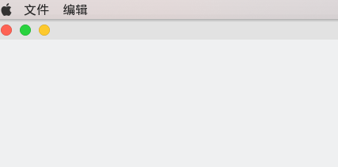
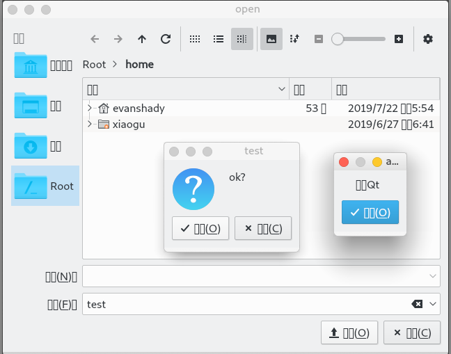
# ui
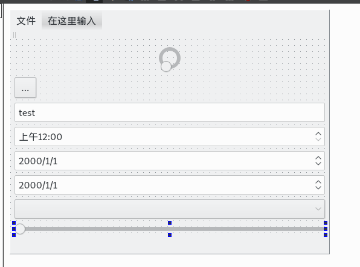
> **布局**
----
**局部布局和全局布局,**
**一样是在ui的模式下进行的，因为这样比较简单而且实际。**
----
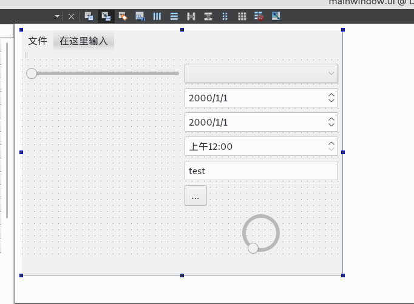
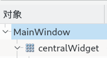

**布局最好在ui模式，因为简单！！！**
----
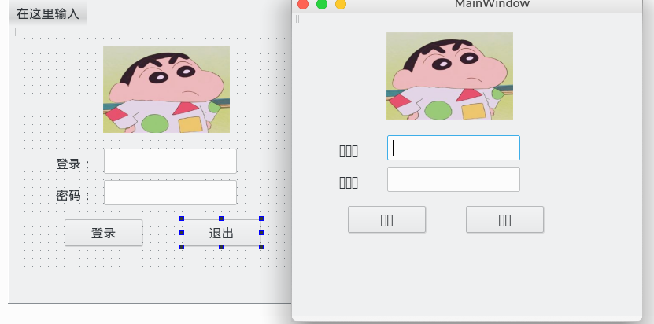
# 设置
**接下的操作是在ui的模式下完成的，并继承于Mainwindow**
```
#inlcude "MainWindow.h"
#include <ui_mainwindow.h>
#include <QDebug>//打印的头文件
#include <QStringList>
#include <QCompleter>

MainWindow::MainWindow(QWidget *parent):QMainwindow(parent){
        ui->setupUi(this);
        //在ui的模式下添加LineEdit(行编辑)
        QString str=ui->LineEdit->text();//获取一行里的内容
        qDebug<<str;//打印
        ui->LineEdit->setText("123456");//设置内容
        ui->LineEdit->setTextMargins(10,0,0,0);//更改方度(左,右,上,下)
        ui->LineEdit->setEchomode(QLineEdit::psaaword);//把内容设置为密码的模式
        QStringLest cin;//声明字符串
        cin<<"hello"<<"how are you"<<"Hehe";//定义字符串
        QCompleter *com=new QCompleter (cin,this);//把字符串放进模型里
        com->setCaseSensitivity(Qt::CaseInsensitive);//把模型设置成不区分大小写
        ui->LineEdit->setCompleter(com);//把模型加进行编辑
}
```
# 样式
1 方箱模型
2 前景和背景
3 控制大小
4 创建缩放式
5 处理伪状态
**关键字(setStyleSheet)**
* 创建的是Widget，是在ui的模式下添加了一个label和PushButton。
```
// .cpp
  ui->pushButton->setStyleSheet("QPushButton{"
  "color:rgb(0,255,255);" //设置颜色，自动调制颜色
  "backgroud-color:red;" //设置背景颜色
  "border: 2px outset grenn;"//创建缩放式(设置边框像素，输出设置，输出的颜色)
  "border-image:url(:/new/prefix1/头像.jpg);"//设置成相片，
 "}"
        "QPushButton:hover{"//当鼠标抬起就更换照片
        "border-image:url(:/new/prefix1/test.jpg)"
        "}"
        "QPushButton:pressed{"//当鼠标按下就更换照片
        "border-image:url(:/new/prefix1/test1.jpg)"
        "}"
 );
```
* border (平铺的方式) 

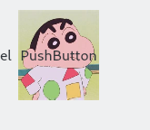
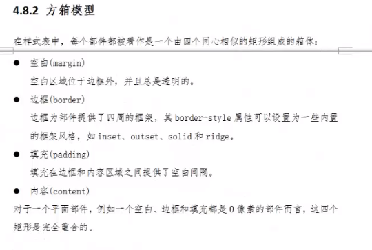
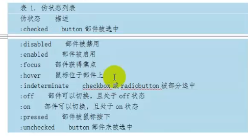
# Event(事件)
**事件，也可以说是中断。就好比你在说话的时候，有一个人在你旁边也在跟你说事情，你得停下来先听他说完，这也可以说是那个人说话的时候中断了你说话，在Qt里有专门处理中断的函数，但它还得先判断你的中断是那种类型的，它再来处理中断的事件。**
----
```
// 这里是在ui的模式下添加了label，然后又添加了新文件，最后在ui里把label提升为槽函数而实现的。
// .h
#include <QLabel>
class Mylabel : public Qlabel{
        protected://保护的(重写事件里的虚函数)
        //鼠标按下
        void mousePressEvent(QMouseEvent *ev);
        //鼠标抬起
        void mouseReleaseEvent(QMouseEvent *ev);
        //鼠标移动
        void mouseMoveEvent(QMouseEvent *ev);
        //鼠标在里面
        void enterEvent(QEvent *);
        //鼠标在外面
        void leaveEvent(QEvent *);
}
// .cpp
#include "Mylabel.h"
#include <MouseEvent>//事件的头文件
#include <QDebug> //打印
Mylabel::Mylabel(QWidget *parent):QLabel(parent){
        //设置追踪鼠标(设置了鼠标追踪就会在程序里自动追踪鼠标，没有设置的话，你还得在窗口里点一下才能出来数据)
        this->setMouseTracking(true);
}
void Mylabel::mousePressEvent(QMouseEvent *ev){
        int i=ev->x();//x的坐标
        int j=ev->y();//y的坐标
QSting str=QString ("<center><h1>mouse press:(%1,%2)</h1></center>")
.arg(i).arg(j);
// 语法(参数是字符) (center(字体加粗))
this->setText(str);//设置
if(ev->Button()==Qt::LefeButton){//判断鼠标按钮在左边，右边，中间
        qDebug()<<"left";
}else if(ev->Button()==Qt::RightNutton){
        qDebug()<<"right";
}else if(ev->Button()==Qt::MidButton){
        qDebug()<<"wid";
}
void Mylabel::mouseReleaseEvent(QMouseEvent *ev){
QSting str=QString ("<center><h1>mouse press:(%1,%2)</h1></center>")
.arg(ev->x()).arg(ev->y());
this->setText(str);
}
void Mylabel::mouseMoveEvent(QMouseEvent *ev){

QSting str=QString ("<center><h1>mouse move:(%1,%2)</h1></center>")
.arg(ev->x()).arg(ev->y());
this->setText(str);
}
void Mylabel::enterEvent(QEvent *e){
        QString str=QString("<center><h1>Event:enter</h1></center>");
        this->setText(str);
}
void Mtlabel::lavceEvent(QEvent *e){
        QString str=QString("<center><h1>Event:leave</h1><.center>");
        this->setText(str);
}
}
```
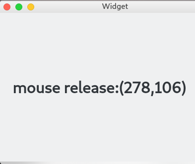

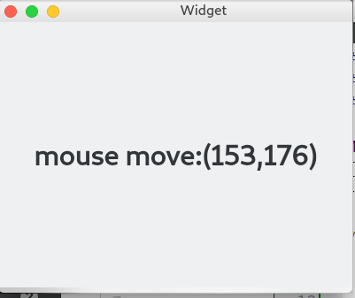

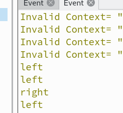

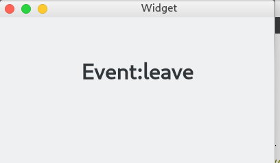
> 时间的处理与忽略
* 继承于widget的前提下，简写。
```
// .h
void closeEvent (QEvent *event);//关闭事件
// .cpp
#include "Widget.h"
#include <QMessageBox>//对话框头文件
void Widget::closeEvent(QEvent *event){
        int test=QMessageBox::question(this , "question","sure?",
        QMessageBox::Yes |
        QMessageBox::No);
        if(test==QMessageBox::Yes){
                event->accept();//处理
        }else{
                event->ignore();//忽略
        }

}
```
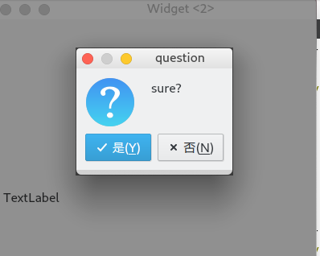
# 绘画
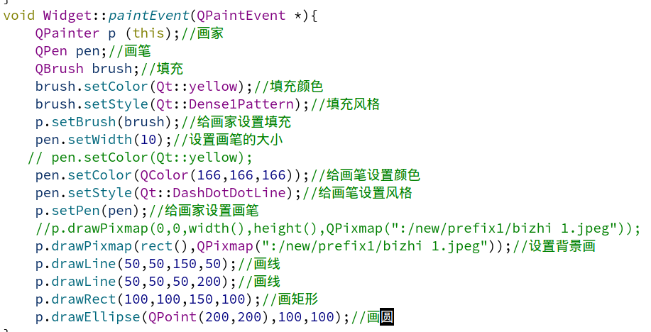
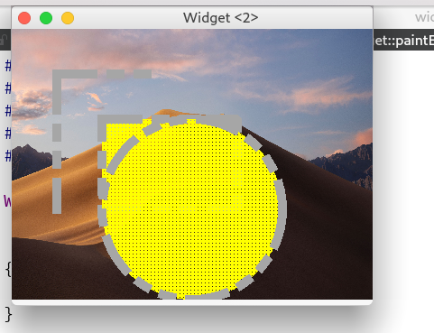

# 绘图设备
* Pixmap(在平台上不能对图片进行修改)
* Image(和平台无关平台上，可以对图片进行修改)
* picture(保存绘图的状态，以二进制的文件进行保存)

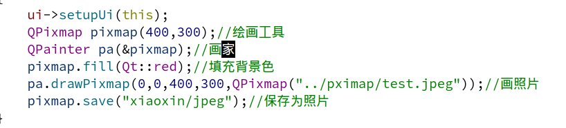
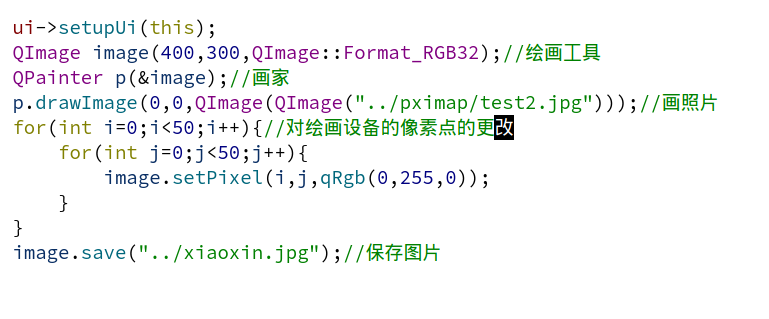
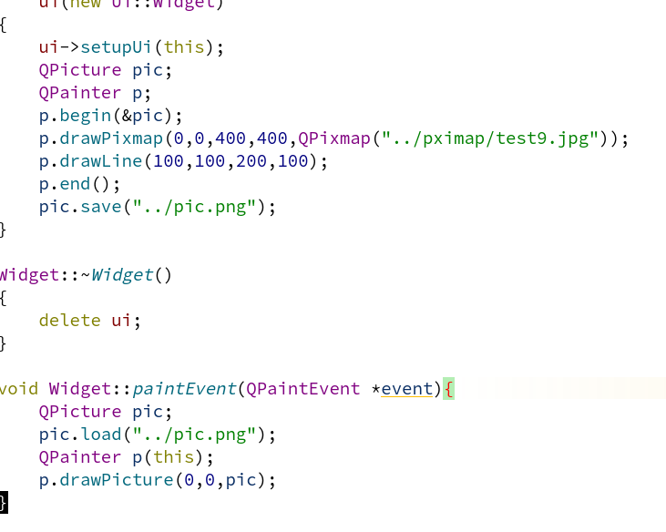
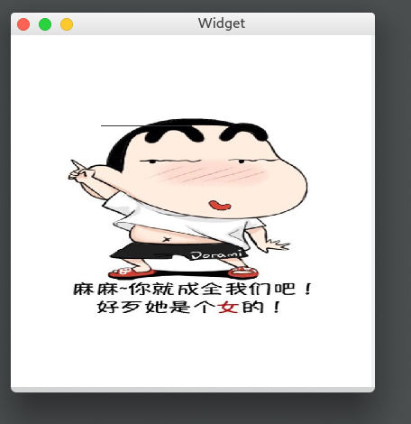
![[icture]](Qt/Qt_picture2.png)

**其实在写这些代码的时候遇到的问题挺多的，明明讲的和我写的是一样的，但我文件管理器就是没有图片，弄得我挺自闭的，换一种方式定义画家就解决了。**
----
> QPixmap&&QImage

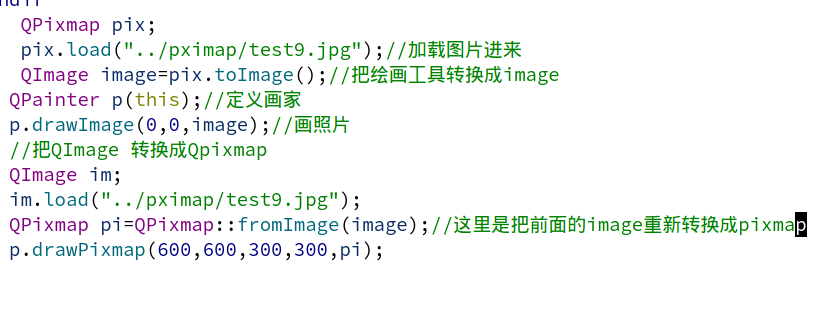


----
# 不规则的窗口
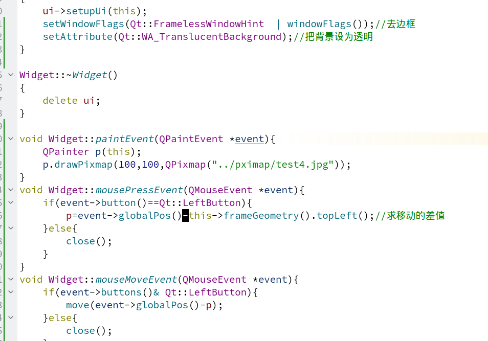


**绘画。我们一般都是在窗口上。而关于怎么样进行绘画，我们是选择重写绘画事件来完成绘画的，一般来说都是先定义画家，然后再选择绘画的设备(this)。我们也不一定就在窗口上绘画，在软件里还有三种设备可以让我们在上面绘画(QPixmap(保存的是图片),QImage(保存的是图片),Qpicture(保存的是二进制文件))，save(保存),load(加载)，Rect(矩形)。**
 ----
# File
**不管在那个语言上，文件的操作都有一定的重要性，所以就把它学好。**
* 普通的形式写读文件()

```
// 用到的头文件
#include <QFile>
#include <QFileDialg>
#include <QFileInfo>
```
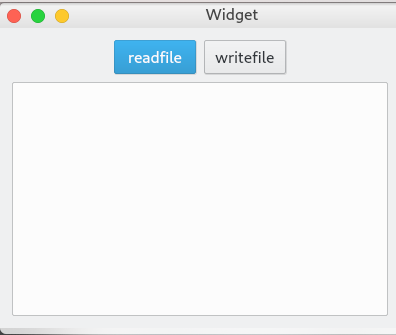
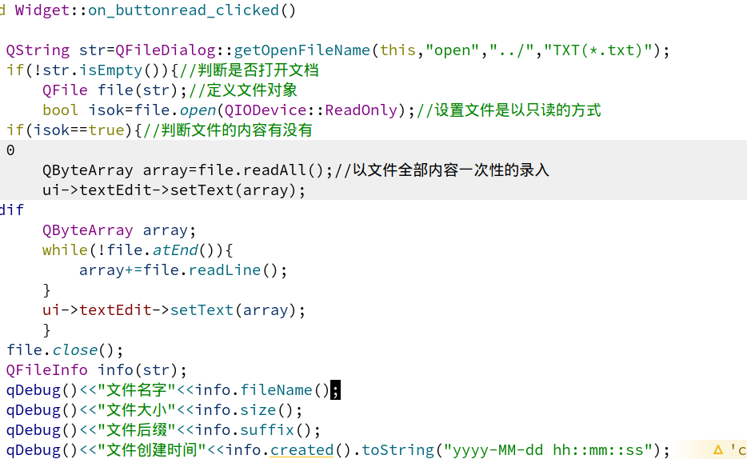
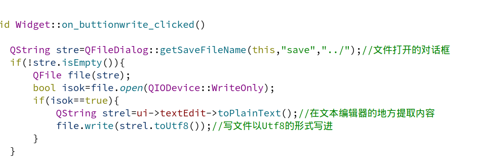
* 是以二进制的形式保存文件
```
// 用到的头文件
#include <QFile>
#include <QDatestram>
```
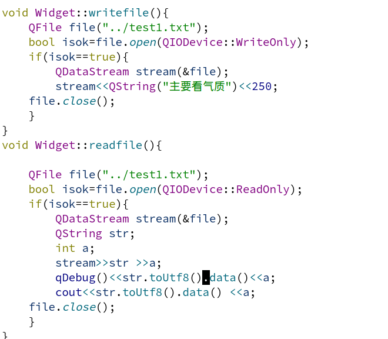
# Server
**记得在项目文件里加(network),这是针对于在类对象里没有提示。还有就是连则表达式(CONFIG+=c++11)**
----
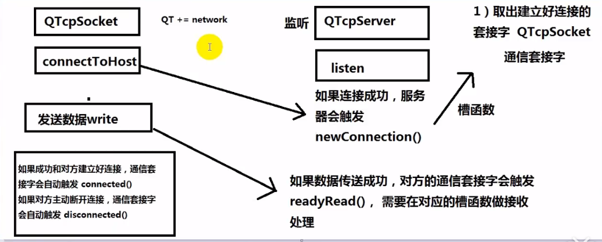
**写代码最重要的是逻辑要清晰，时刻的知道自己在写什么，所以，软件怎样运行我们是一定要搞清楚的。**
----
```
//用到的头文件
#include <QTcpServer>
#include <QTcpsocket>
```
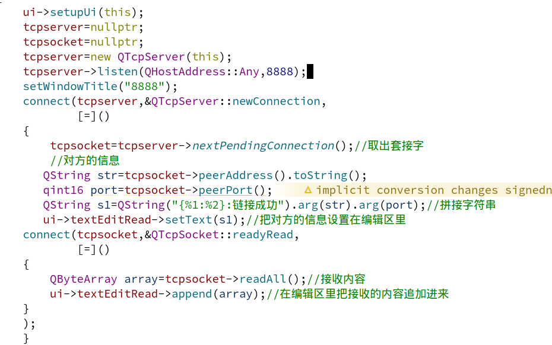
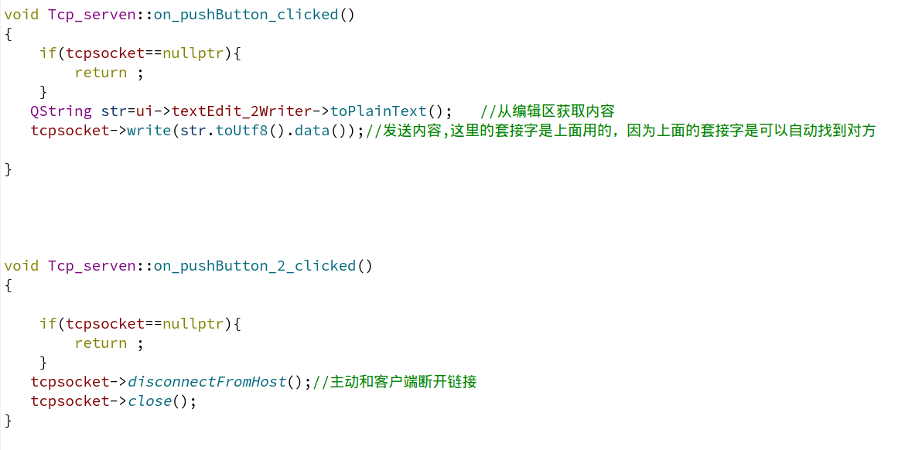
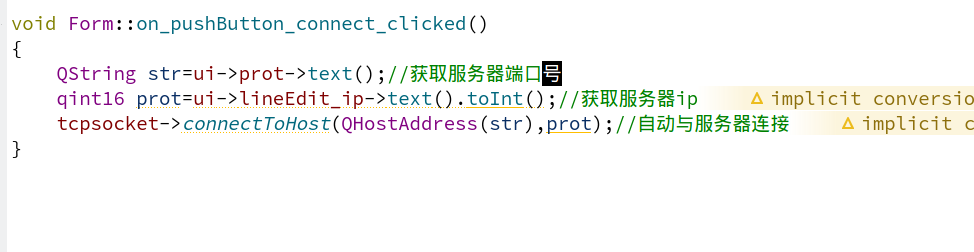
**其实在上面的刚开始的第一张图就很清晰的讲到了tcp的连接过程，只要我们真的理解了就能看的明白。在这里也没什么好解释的，有很多的函数都是在函数里订好了的，只要我们搞清楚什么时候调用什么函数就行了。**
> UDP
* 它是面向无连接的通信，所以在这里就只需要通信的套接字(socket)。
```
// 用到的头文件
#include <QUdpSocket> //.h(不要忘记在.h文件里声明socket套接字)
#include <QHostAddress>// .cpp
```
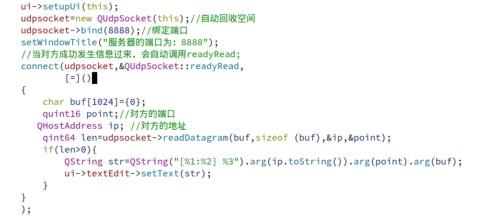
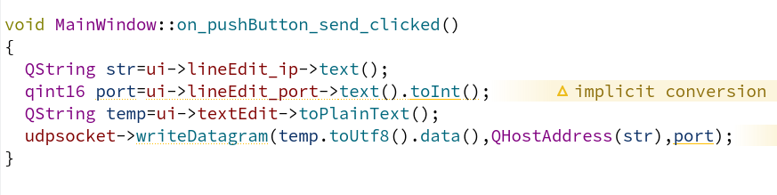
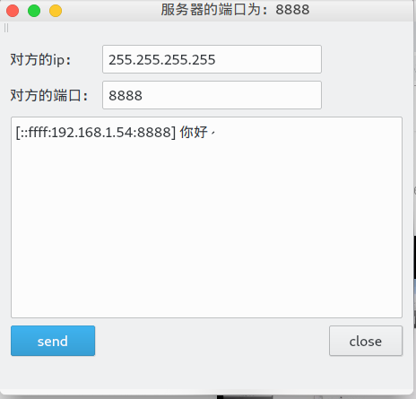
# tcpfile
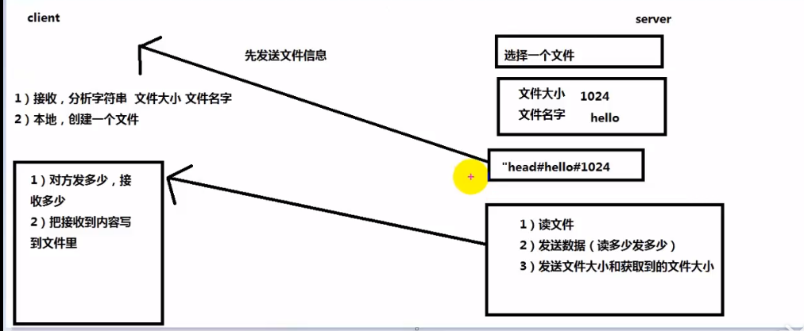
**值得注意的是，tcp在发组的时候，头文件的信息和数据是一起跟着发过去的，所以我们在这里要用定时器来缓一下时间，让它先发头文件，后发数据。这样一来我们的头文件信息和数据就不会搞混，还有就是tcp发包是不会丢失的。**
-----