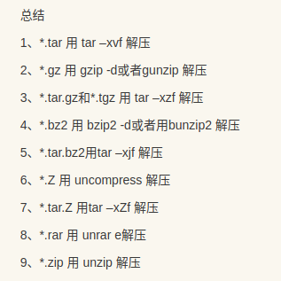
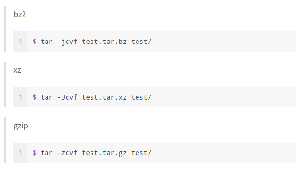

注释
<!--more-->
# TAR
**tar(打包命令)也可以说是备份，在我们管理文件的时候有很多的好处，当我们的文件各自的位置不一样的时候这时就是打包发挥的时候了。你只需要一条命令就可解决这些傻逼问题，下面是一些tar常用的命令**
---
//声明:test1,test2,是存在的文件，也是你接下来要操作的文件。
1. tar -cf file.tar test1    
//这里是把test1这个文件打包在一个file.tar的包里面,这里的c是创建一个文件，f后面是紧跟这文件名。
2. tar -rf file.tar test2
//这里是把test2追加到file.tar文件中,r是追加。
3. tar -uf file.tar
//这里是把刚刚的file.tar文件更新，u是更新的意思。
4. tar -tf file.tar
//这里是把file.tar文件的内容列出来，t是查看文件中的内容。
5. tar -xf file.tar
解压file.tar文件
**值得注意的是后面跟着的一定要是文件名！！！**
> tar调用gzip
* tar -czf filetest1.tar.gz file1
//调用gzip要使用-z的参数，意思是和上面一样的，c是创建一个文件，f后面紧跟着文件名。 
* tar -xzf filetest1.tar.gz
//解压上面的文件
>> 压缩
1. 上面是用tar打包，这里就是用zip压缩。
zip -r test3.zip file.tar
//这里是把上面的文件压缩到新的文件。
unzip test3.zip
//解压。
**在这里文件的后缀名很重要，因为这关系着我们的文件性质，有的时候你会因为文件的后缀名而把你自己搞自闭，**
**所以你要在每次操作文件之前要想清楚操作之后的文件的后缀是什么类型的，也要接的上你将要操作文件的后缀,**
**不能说，前一个文件后缀和你后面的文件的后缀不一样，这样也是不可以的。**
---

***
**压缩的方法有多种，但我觉得也没必要都记住，因为大多数都只是参数不一样而已，大多的格式是一样的。**
**只要我们能在工作中解决自身的小问题就行，其它的，慢慢就会记住的，在这里我还是挺赞同小伙子说的一句话。**
**你想要最短的时间学会你想学的东西，你就一定要多去用它，这样你才是最快的掌握它。**
***

#### 无标题
1. 我是从下午四点多学到现在的，中间尝试了很多，自己也就慢慢的理解了，接下来也就是有事没事就操作一波的事情。
2. 感觉linux要完全掌握真的不是一件简单的事情，要一步一步的走向它，你得慢慢地去学，我希望以后的自己是每天都有学习的，因为我是这么想的，但偶尔给自己放放假也是可以的,因为你是人，不是一个冷冰冰的机器，你有开心，难过，伤心，烦躁的时候，但你随着时间的流逝，有时你的年龄是不允许你做的一些事情，没有小时候的随心所欲，在别人的眼里只不过是一个小孩子的幼稚而已。
3. 七月的风，八月的雨，卑微的我喜欢遥远的你。
